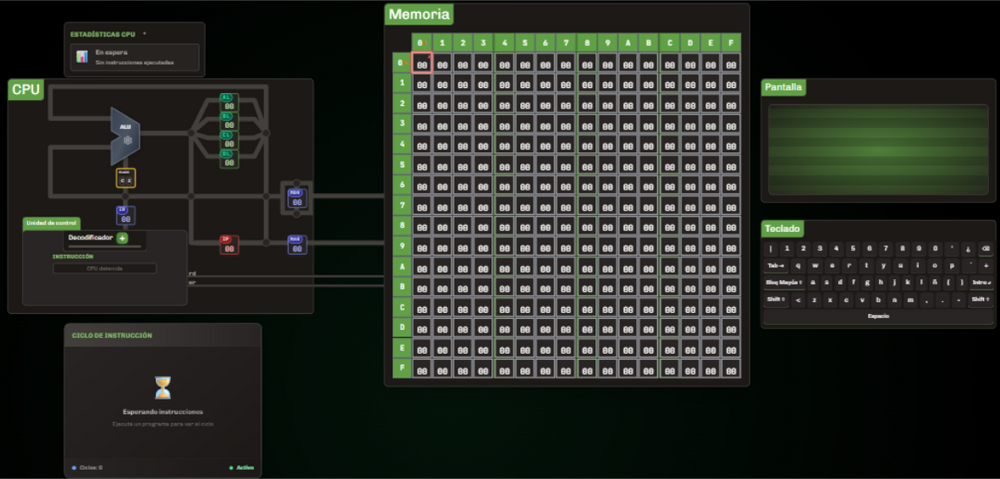
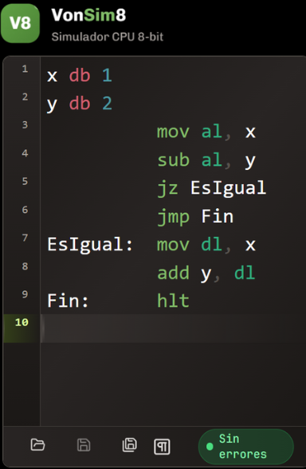
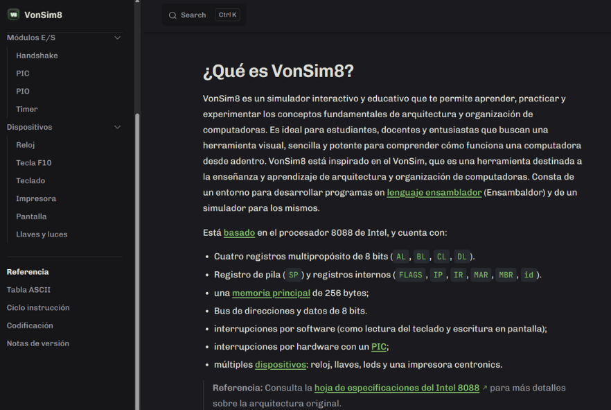

# Diseño y Construcción del Simulador {#desarrollo}
En este capítulo se describe el diseño y desarrollo de una herramienta de simulación específica para la arquitectura x86, orientada a facilitar la enseñanza de los principios de arquitectura de computadoras. Se detalla la justificación del diseño, los pasos seguidos para su construcción y los métodos utilizados para validar su funcionalidad.

En el capítulo anterior se analizaron y evaluaron las herramientas de simulación existentes para la arquitectura x86. Esta revisión exhaustiva permitió identificar las limitaciones de las soluciones actuales y fundamentar la necesidad de desarrollar una herramienta específica (véase el capítulo \@ref(comparativa)).

A partir de esta necesidad, se establecieron un conjunto de requisitos funcionales y pedagógicos que guiaron de manera integral el diseño, la implementación y la validación del simulador. Estos requisitos no solo responden a las limitaciones observadas en herramientas existentes, sino que se alinean con los objetivos educativos previamente definidos.

## Requisitos de la herramienta y su fundamentación
Esta sección expone los requisitos que orientaron el diseño del simulador, clasificados en dos dimensiones complementarias: pedagógica y funcional. La primera se vincula con los objetivos formativos definidos en el capítulo introductorio (\@ref(intro)), mientras que la segunda refiere a las características técnicas necesarias para garantizar su implementación eficaz. Su definición se apoyó en principios pedagógicos y técnicos, y se complementó con una validación empírica basada en entrevistas semiestructuradas a docentes expertos. Este proceso permitió identificar necesidades concretas del aula, así como carencias en las herramientas existentes (ver Anexo A \@ref(anexoA)). La aplicación de una metodología cualitativa, centrada en entrevistas semiestructuradas a docentes expertos, permitió identificar necesidades auténticas del aula y carencias específicas en las herramientas existentes. Estos hallazgos aportaron una base empírica rigurosa para la formulación técnica y pedagógica de los requisitos que guían el diseño del simulador [@huberman2019qualitative].

1. **Visualización de la estructura general de la computadora:**
Incluir una representación gráfica de la arquitectura básica de la computadora —compuesta por CPU, buses, memoria y dispositivos de entrada/salida— durante la ejecución de los programas. La visualización debe destacar los componentes activos en cada etapa del ciclo de ejecución, facilitando una comprensión sistémica e integrada del funcionamiento de la computadora. El uso de representaciones gráficas como recurso didáctico está respaldado por estudios que demuestran su efectividad para facilitar la comprensión de conceptos abstractos en disciplinas técnicas [@sorva2013visualizations]. La Figura \@ref(fig:diagramasimulador) presenta un diagrama estructural que representa los principales módulos del simulador y sus interacciones. Este recurso visual permite integrar, de forma esquemática, los componentes funcionales implementados y su correspondencia con los objetivos pedagógicos definidos.

```{r diagramasimulador, echo=FALSE, fig.cap="Estructura del simulador y componentes funcionales", fig.align = 'center', out.width = "90%"}

```

2. **Soporte para la generación y ejecución de programas en ensamblador:**
Incorporar la posibilidad de ejecutar programas escritos en lenguaje ensamblador tanto de forma paso a paso como en ejecución continua. Esta funcionalidad posibilita el análisis detallado de cada instrucción, fortaleciendo competencias en trazado y depuración de código ensamblador, fundamentales para comprender la relación entre software y hardware.
La inclusión de un editor de ensamblador con resaltado de sintaxis y autocompletado mejora la experiencia del usuario, facilitando la escritura y comprensión del código. Esta funcionalidad se basa en principios de diseño de interfaces que promueven la usabilidad y la accesibilidad [@w3c_accessibility_2021]. El editor debe permitir al usuario escribir, editar y guardar programas en ensamblador, así como ejecutar estos programas dentro del simulador. La incorporación de entornos de desarrollo integrados (IDEs) en contextos educativos ha demostrado ser eficaz para la enseñanza de lenguajes de programación, según diversos estudios [@mccracken2001does].

```{r editor, echo=FALSE, fig.cap="Editor ensamblador", fig.align = 'center', out.width = "90%"}

```

3. **Repertorio reducido de instrucciones con activación progresiva:**
Se selecciona un subconjunto esencial del conjunto de instrucciones x86, el cual se habilita en etapas secuenciales del proceso de enseñanza, en correspondencia con el avance de los contenidos curriculares. Esta decisión se fundamenta en principios de la psicología cognitiva que sugieren que la introducción escalonada de contenidos técnicos mejora la retención y reduce la sobrecarga cognitiva [@nationalacademies2018how]. Esta estrategia también se encuentra respaldada por autores como Hasan [@hasan_survey_2012], Null y Lobur [@null_essentials_2023], y Stallings [@stallings_computer_2021], quienes proponen abordajes similares en la enseñanza de arquitecturas complejas.
    ```{r activacionprogresiva, echo=FALSE, message=FALSE, warning=FALSE}
    library(knitr)
    library(kableExtra)

    # Crear los datos de la tabla de activación progresiva
    activacionprogresiva <- data.frame(
      Fase = c("Inicial", "Intermedia", "Avanzada"),
      `Instrucciones activadas` = c(
        "MOV, ADD, SUB, HLT",
        "CMP, JMP, JZ, JC",
        "CALL, RET, IN, OUT, INT, IRET"
      ),
      `Objetivo didáctico` = c(
        "Comprensión del ciclo de instrucción básico",
        "Introducción a control de flujo",
        "Manejo de periféricos e interrupciones"
      )
    )

    tabla_activacion <- kable(activacionprogresiva,
                  format = ifelse(knitr::is_latex_output(), "latex", "html"),
                  caption = "Activación progresiva del repertorio de instrucciones",
                  col.names = c("Fase", "Instrucciones activadas", "Objetivo didáctico"),
                  booktabs = TRUE,
                  escape = FALSE,
                  align = c("c", "c", "c"))

    if (knitr::is_latex_output()) {
      tabla_activacion %>%
        kable_styling(
          latex_options = c("scale_down", "hold_position"),
          font_size = 10,
          position = "right"
        ) %>%
        column_spec(1, width = "2cm", bold = TRUE, border_right = TRUE) %>%
        column_spec(2, width = "4cm") %>%
        column_spec(3, width = "6cm") %>%
        row_spec(0, bold = TRUE, align = "c", background = "#D3D3D3") %>%
        row_spec(seq_len(nrow(activacionprogresiva)),
                 extra_latex_after = "\\addlinespace[10pt]")
    } else {
      tabla_activacion %>%
        kable_styling(
          bootstrap_options = c("striped", "hover", "condensed", "responsive"),
          full_width = FALSE,
          position = "center"
        ) %>%
        column_spec(1, width = "12em", bold = TRUE, border_right = TRUE) %>%
        column_spec(2:3, width = "28em") %>%
        row_spec(0, bold = TRUE, color = "white", background = "#0073C2")
    }
    ```
Una vez establecido el repertorio esencial, se plantea avanzar hacia una comprensión más profunda del ciclo de instrucción mediante su representación en el nivel microarquitectónico. Esta representación incluirá la visualización dinámica de registros activos y señales de control, en correspondencia directa con la ejecución de cada instrucción. Este enfoque promueve el desarrollo progresivo de competencias, al mitigar la sobrecarga cognitiva que implicaría abordar de forma prematura el repertorio completo de instrucciones. La activación progresiva del repertorio se fundamenta en teorías de aprendizaje que sugieren que la exposición gradual a nuevos conceptos mejora la comprensión y retención [@sweller2010cognitive]. Además, esta estrategia se alinea con las recomendaciones de autores como Null y Lobur [@null_essentials_2023], quienes destacan la importancia de introducir los conceptos de forma escalonada para facilitar el aprendizaje efectivo.

4. **Simulación visual e interactiva de micropasos de instrucciones:**
Se implementa una visualización interactiva del flujo de datos basada en el modelo de Nivel de Transferencia entre Registros (Register Transfer Level, RTL). Este enfoque permite representar con precisión el desplazamiento de datos entre registros, buses y unidades funcionales del procesador, así como las señales de control involucradas en cada fase del ciclo de instrucción [@ASMVisualizer2025; @harris2015digital]. Stallings [@stallings_computer_2021] propone utilizar el modelo RTL para representar el ciclo de instrucción, desde la captura (fetch) hasta la ejecución (execute), facilitando la visualización del recorrido de datos y de las señales de control en cada etapa del proceso. 
Como complemento a la descripción anterior, la Figura \@ref(fig:cicloinstruccion) ilustra un ciclo de instrucción típico utilizando la operación MOV AL, BL como ejemplo. Esta representación facilita la identificación de las etapas *fetch*, *decode* y *execute*, así como los registros que participan activamente en cada fase.

```{r cicloinstruccion, echo=FALSE, fig.cap="Ciclo de instrucción: captación y ejecución", fig.align = 'center', out.width = "85%"}
knitr::include_graphics(path = "images/cicloinstruccion.png")
```
    
5. **Gestión básica de interrupciones y periféricos:**
Incluir un vector de interrupciones predefinido que simule eventos externos, como la entrada de datos mediante teclado o la salida de información a través de un monitor. Estas interacciones permiten emular situaciones reales de asincronía, esenciales para la comprensión de mecanismos como la interrupción del flujo de ejecución. Esta funcionalidad tiene un alto valor pedagógico, ya que permite al estudiante explorar de forma interactiva conceptos fundamentales como la asincronía, el manejo de eventos y la interrupción del flujo secuencial de ejecución, los cuales son característicos del diseño de arquitecturas modernas y fundamentales para comprender el funcionamiento de sistemas reales. Su inclusión se alinea con las recomendaciones de autores como Null y Lobur [@null_essentials_2023], quienes destacan el valor de abordar estos conceptos en etapas tempranas de la formación. Además, se incorpora un módulo genérico de entrada/salida programada (Programmed Input/Output, PIO), que actúa como interfaz entre la CPU y los dispositivos periféricos. Este módulo permite simular operaciones mediante instrucciones como IN y OUT, facilitando la interacción del estudiante con dispositivos representados gráficamente, como interruptores y teclas. De esta forma, se promueve una comprensión más tangible de los mecanismos subyacentes al intercambio de información entre el procesador y los dispositivos externos.

```{r perifericos, echo=FALSE, fig.cap="Módulo genérico de entrada/salida programada", fig.align = 'center', out.width = "85%"}
knitr::include_graphics(path = "images/perifericos.png")
```

6. **Métricas de rendimiento:**
Incluir indicadores clave como tiempo de ciclo, tiempo de CPU y ciclos por instrucción (CPI), generados automáticamente a partir de la ejecución de los programas. stos indicadores permiten al estudiante analizar cuantitativamente la eficiencia de la ejecución de un programa, facilitando comparaciones entre diferentes implementaciones. Su inclusión apunta a fortalecer la comprensión de aspectos clave del rendimiento del procesador, promoviendo una formación integral que contemple tanto aspectos funcionales como métricos del comportamiento del sistema [@hennessy2017computer].

```{r metricas, echo=FALSE, fig.cap="Métricas de rendimiento", fig.align = 'center', out.width = "85%"}
knitr::include_graphics(path = "images/metricas.png")
```

7. **Interfaz intuitiva y experiencia de usuario:**
Diseñar una interfaz gráfica de usuario (GUI) intuitiva, accesible y coherente con principios de usabilidad. La organización visual debe facilitar la navegación, la comprensión del flujo de datos y la ejecución de tareas pedagógicas sin distracciones. Se recomienda el uso de colores, etiquetas y animaciones para reforzar el aprendizaje visual, especialmente para representar cambios de estado del sistema y flujos de control [@w3c_accessibility_2021].

8. **Documentación y recursos de apoyo:**
Proporcionar documentación clara y accesible que explique el funcionamiento del simulador, sus componentes y las instrucciones disponibles. Esta documentación debe incluir ejemplos prácticos, guías de uso y recursos adicionales para facilitar la comprensión y el aprendizaje autónomo. La inclusión de tutoriales interactivos y ejemplos prácticos es fundamental para guiar al estudiante en el uso efectivo del simulador, promoviendo un aprendizaje activo y reflexivo [@bonwell1991active].

```{r documentacion, echo=FALSE, fig.cap="Documentación on line", fig.align = 'center', out.width = "90%"}

```

Estos requisitos funcionales y pedagógicos se fundamentan en principios de diseño instruccional y psicología cognitiva, y fueron validados mediante entrevistas con docentes expertos en la materia. A través de reuniones y talleres de validación donde se analizaron prototipos tempranos y necesidades concretas del aula, garantizando así su relevancia didáctica y su adecuación al contexto educativo de la asignatura Arquitectura de Computadoras.

En conjunto, estos requisitos orientan el diseño del simulador para maximizar su impacto pedagógico y su utilidad como recurso de apoyo a la enseñanza de arquitectura x86. En la siguiente sección se describe cómo fueron implementados funcionalmente estos requisitos, detallando su correspondencia con la estructura modular del simulador. La Tabla \@ref(tab:requisitosresumen) resume los principales requisitos funcionales del simulador, junto con los componentes específicos que los implementan.

```{r requisitosresumen, echo=FALSE, message=FALSE, warning=FALSE}
library(knitr)
library(kableExtra)

# Crear los datos de la tabla de requisitos y fundamento
requisitosresumen <- data.frame(
  Requisito = c(
    "Visualización de estructura",
    "Ejecución de programas en ensamblador",
    "Repertorio progresivo de instrucciones",
    "Simulación visual de micropasos",
    "Módulo de Entrada/Salida + Vector de interrupciones"
  ),
  Fundamento = c(
    "Comprensión sistémica del hardware",
    "Desarrollo de competencias en lenguaje ensamblador",
    "Disminución de sobrecarga cognitiva",
    "Comprensión del flujo interno de datos",
    "Simulación de asincronía real"
  )
)

tabla_requisitos <- kable(requisitosresumen,
               format = ifelse(knitr::is_latex_output(), "latex", "html"),
               caption = "Resumen de requisitos funcionales y su fundamentación pedagógica",
               col.names = c("Requisito", "Fundamento pedagógico"),
               booktabs = TRUE,
               escape = FALSE,
               align = c("c", "c"))

if (knitr::is_latex_output()) {
      tabla_requisitos %>%
        kable_styling(
          latex_options = c("scale_down", "hold_position"),
          font_size = 10
        ) %>%
        column_spec(1, width = "5cm", bold = TRUE, border_right = TRUE) %>%
        column_spec(2, width = "8cm") %>%
        row_spec(0, bold = TRUE, align = "c", background = "#D3D3D3") %>%
        row_spec(seq_len(nrow(requisitosresumen)),
                 extra_latex_after = "\\addlinespace[10pt]")
    } else {
      tabla_requisitos %>%
        kable_styling(
          bootstrap_options = c("striped", "hover", "condensed", "responsive"),
          full_width = FALSE,
          position = "center"
        ) %>%
        column_spec(1, width = "16em", bold = TRUE, border_right = TRUE) %>%
        column_spec(2, width = "32em") %>%
        row_spec(0, bold = TRUE, color = "white", background = "#0073C2")
    }
```

### Fundamentación de los requisitos del simulador
A partir de los requisitos funcionales detallados anteriormente, se llevó a cabo un proceso colaborativo de análisis con docentes^[Docentes: Marcelo A. Colombani y Amalia G. Delduca] de la asignatura Arquitectura de Computadoras, quienes aportaron su experiencia docente para identificar los elementos de la arquitectura x86 que resultaban prioritarios para representar, simplificar o adaptar en función de los objetivos pedagógicos del simulador. Este análisis condujo a la elección de una arquitectura simplificada de 8 bits, cuyas características se describen más adelante, justificado por su valor didáctico: una arquitectura de 8 bits permite reducir significativamente la complejidad del modelo, sin comprometer la enseñanza de conceptos fundamentales como el ciclo de instrucción, la manipulación de registros o el manejo de interrupciones, permitiendo representar procesos clave con mayor claridad y menor carga cognitiva. La menor cantidad de líneas de datos, registros y operaciones simplifica la visualización de procesos como la ejecución de instrucciones, el flujo de datos y el manejo de interrupciones, favoreciendo la comprensión por parte del estudiante en etapas iniciales del aprendizaje.

La arquitectura x86 se caracteriza por su elevada complejidad, derivada de su extenso repertorio de instrucciones y sus múltiples características avanzadas. Frente a este panorama, el diseño del simulador adopta un enfoque instruccional basado en tres principios pedagógicos clave:

- **Reducir la carga cognitiva**: la simplificación del repertorio y de los componentes permite a los estudiantes enfocarse en principios fundamentales.
- **Aprendizaje progresivo**: se adopta un enfoque escalonado, empezando con un modelo simplificado y avanzando hacia representaciones más completas de x86.
- **Claridad pedagógica**: las prácticas son manejables en términos de tiempo y esfuerzo, favoreciendo un aprendizaje activo, centrado en la resolución progresiva de problemas y libre de sobrecarga cognitiva excesiva.

### Beneficios de la simplificación
El diseño del simulador contribuye a:

- **Comprensión fundamental**: los estudiantes pueden enfocarse en el ciclo de instrucciones, interacción de componentes y flujo básico de datos.
- **Análisis crítico**: comparar el modelo simplificado con x86 real fomenta un aprendizaje reflexivo y profundo.
- **Experimentación práctica**: proporciona un entorno accesible para explorar conceptos y corregir errores.

Diversos autores como Patterson & Hennessy [@hennessy2017computer], Tanenbaum [@tanenbaum_structured_2016] y Null [@null_essentials_2023]  coinciden en que el uso de arquitecturas simplificadas, como las de 8 bits, permite a los estudiantes centrarse en los conceptos fundamentales de la arquitectura de computadores sin verse abrumados por la complejidad técnica de arquitecturas reales. Este enfoque hace posible observar la transferencia de datos entre registros y la activación de señales de control en cada etapa, favoreciendo la comprensión del funcionamiento interno del procesador.
El modelo propuesto adopta una arquitectura simplificada de 8 bits, inspirada en los principios de la arquitectura x86 [@intel_microarchitecture_2021], y diseñada con un repertorio reducido de instrucciones. La elección de una arquitectura de 8 bits obedece a criterios pedagógicos, ya que simplifica el modelo sin sacrificar los principios fundamentales del repertorio x86, facilitando así la comprensión progresiva de sus componentes [@patt2019introduction; @majid1999design; @morlan_sap1_2021 ; @Guald_2015_thesis; @silber_tinycpu].

En síntesis, la definición de estos requisitos busca integrar aspectos funcionales, pedagógicos y técnicos en una herramienta que no solo simule el comportamiento del sistema, sino que facilite activamente los procesos de enseñanza y aprendizaje en arquitectura de computadoras. La articulación entre visualización, ejecución progresiva y análisis de rendimiento proporciona un entorno didáctico rico que responde tanto a las necesidades del aula como a los desafíos de la disciplina.

## Diseño del Simulador
El simulador implementado adopta la arquitectura de Von Neumann, reconocida por su simplicidad conceptual y operativa. En este modelo, los datos y las instrucciones comparten una única memoria, lo que permite tratar las instrucciones como datos. Esta característica facilita técnicas como la ejecución dinámica y la optimización del rendimiento [@stallings_computer_2021].

VonSim^[VonSim: https://vonsim.github.io/] sirvió como referencia por su enfoque educativo e interfaz intuitiva. Sobre esta base se desarrolló VonSim8^[VonSim8: https://ruiz-jose.github.io/VonSim8/], adaptado para operar con registros y memoria de 8 bits y diseñado para el aprendizaje progresivo [@vonsim].

La arquitectura detallada de VonSim, con su amplio repertorio de instrucciones y componentes, ofrece una visión integral del sistema. Sin embargo, dicha riqueza funcional puede abrumar a estudiantes en etapas iniciales. Por esta razón, VonSim8 introduce una simplificación estrategica, con el objetivo de reducir la carga cognitiva en etapas iniciales, facilitando así una apropiación gradual de los conceptos fundamentales. A partir de esta base, se introdujeron diversas modificaciones en los componentes, instrucciones y funcionalidades del simulador, priorizando aquellos aspectos conceptuales que se abordan en el programa de la asignatura.

VonSim [@vonsim] es una herramienta diseñada específicamente para la enseñanza y el aprendizaje de la arquitectura y organización de computadoras. Sus principales características la posicionan como una solución educativa integral:

**Características técnicas y pedagógicas de VonSim:**

1. **Entorno integrado de desarrollo y simulación:** Proporciona un entorno completo que incluye editor de código ensamblador con resaltado de sintaxis y un simulador para la ejecución de programas, facilitando el proceso de aprendizaje práctico [@vonsim].

2. **Fundamento en arquitectura real:** Se basa en el procesador Intel 8088, proporcionando una referencia histórica y técnicamente relevante para el estudio de la evolución de las arquitecturas de computadoras [@intel8086manual].

3. **Componentes esenciales para el estudio:** Incluye cuatro registros multipropósito de 16 bits, memoria principal de 32 kB, bus de direcciones de 16 bits y bus de datos de 8 bits, abarcando los elementos fundamentales para la comprensión de la arquitectura von Neumann [@stallings_computer_2021].

4. **Gestión completa de interrupciones:** Implementa tanto interrupciones por software (entrada/salida de datos) como interrupciones por hardware mediante un controlador de interrupciones programable (PIC), cubriendo aspectos fundamentales de la operación del sistema [@hennessy2017computer].

5. **Simulación de periféricos:** Incorpora dispositivos como reloj, llaves, LEDs e impresora Centronics, inspirados en los especificados por la familia iAPX 88 de Intel, permitiendo simular interacciones complejas con el sistema.

6. **Enfoque pedagógico mediante simplificaciones estratégicas:** No pretende ser un emulador fiel del 8088, sino una herramienta educativa que implementa simplificaciones deliberadas (repertorio de instrucciones reducido y codificación simplificada) para facilitar la comprensión en contextos educativos [@patt2019introduction].

7. **Desarrollo académico especializado:** Creado por Facundo Quiroga, Manuel Bustos Berrondo y Juan Martín Seery, con colaboración de Andoni Zubimendi y César Estrebou, específicamente para las cátedras de Organización de Computadoras y Arquitectura de Computadoras de la Facultad de Informática de la Universidad Nacional de La Plata, garantizando su alineación con objetivos curriculares específicos.

8. **Fundamento en experiencia previa:** Se apoya en el simulador MSX88, desarrollado en 1988 por Rubén de Diego Martínez para la Universidad Politécnica de Madrid, aprovechando décadas de experiencia acumulada en simuladores educativos.

9. **Accesibilidad y sostenibilidad:** Distribuido bajo licencia GNU Affero General Public License v3.0 con código fuente disponible en GitHub, y documentación bajo licencia CC BY-SA 4.0, facilitando su estudio, modificación y mejora continua [@opensource_licensing_2024].

En síntesis, VonSim constituye una herramienta robusta y accesible que simplifica y facilita el aprendizaje de conceptos complejos de arquitectura de computadoras mediante simulación práctica y una interfaz pedagógicamente orientada.

Las modificaciones principales de VonSim8, alineadas con objetivos pedagógicos, incluyen:

Del registro de estado del simulador original se ocualtaron las banderas I, O y S ya que en los primeros ejericios de ensamblador no se requiere su uso ya que se trabaja solamente con números enteros positivos, posteriormente las mismas se pueden habilitar en el menu configuración del simulador.

```{r banderas, echo=FALSE, fig.cap="Registro de estado", fig.align = 'center', out.width = "85%"}
knitr::include_graphics(path = "images/flags.png")
```

El flag de interrupcion I solo se muestra cuando el programa lo requiere, por ejemplo, al ejecutar una instrucción de interrupción como `INT` o `IRET`. Esto permite a los estudiantes observar cómo se activa y desactiva este flag en función de las operaciones realizadas.

```{r banderaI, echo=FALSE, fig.cap="Registro de estado I", fig.align = 'center', out.width = "85%"}
knitr::include_graphics(path = "images/flagi.png")
```

Se modifico el menu de los controles del simulador.
```{r controles, echo=FALSE, fig.cap="Controles del simulador", fig.align = 'center', out.width = "85%"}    
knitr::include_graphics(path = "images/controles.png")
```

Se eliminaron los registros de 16 bits y se redujo el tamaño de los registros a 8 bits, lo que simplifica la representación y manipulación de datos. Esta decisión se fundamenta en la necesidad de reducir la complejidad del modelo para facilitar la comprensión de los conceptos fundamentales de la arquitectura de computadoras. Tambien se unifico el criterio del diseño de los registro, ahora todos los registros tienen una entrada y una salida independiente, lo que permite una visualización más clara de cómo se transfieren los datos entre los registros y la ALU (Unidad Aritmético Lógica). Esta modificación es esencial para comprender el flujo de datos en el ciclo de instrucción y la interacción entre los componentes del procesador. Tambien se ocultaron los registros registro SP y  (`ri` e `id`) que se habilitan automaticamente al ejecutar una instrucción que requiera su uso. 

```{r registros, echo=FALSE, fig.cap="Registro de 8 bits", fig.align = 'center', out.width = "85%"}    
knitr::include_graphics(path = "images/registros.png")
```

Se elimino el uso de los registros temporales de la ALU (`left` y `rigth`).

```{r leftrigth, echo=FALSE, fig.cap="Eliminación registro temporales left y rigth", fig.align = 'center', out.width = "85%"}    
knitr::include_graphics(path = "images/leftrigth.png")
```

La memoria principal se modela como una matriz de 16×16 expresada en hexadecimal, lo que permite almacenar hasta 256 bytes de datos.

```{r memoriacomp, echo=FALSE, fig.cap="Memoria principal", fig.align = 'center', out.width = "85%"}
knitr::include_graphics(path = "images/memoriacomp.png")
```

Resaldo de la direccion de memoria apuntada por el registro IP.

```{r resaltadoip, echo=FALSE, fig.cap="Resaltado registro IP", fig.align = 'center', out.width = "85%"}
knitr::include_graphics(path = "images/resaltadoip.png")
```

Cuando el progrma tiene instrucciones INT o de manejo de pila se resalta en memoria el el vector de interrucciones, 8 posiciones de memoria desde ` 0x00` a ` 0x07` y la dirección apuntada por el registro SP:

```{r resaltadointsp, echo=FALSE, fig.cap="Resaltado vector de interrupciones y registro SP", fig.align = 'center', out.width = "85%"}
knitr::include_graphics(path = "images/resaltadointsp.png")
```

Visor de instrucciones y datos del programa en memoria, pudiendo ver la instruccion y su tamaño en bytes que ocupa en memoria, ademas la etiqueta asociada a los datos.

```{r visorprog, echo=FALSE, fig.cap="Resaltado vector de interrupciones y registro SP", fig.align = 'center', out.width = "85%"}
knitr::include_graphics(path = "images/visorprog.png")
```

En el VonSim cuando se escribe un programa en el editor del simulador es obligatorio que la sección de codigo inicie con la directiva `org 0x2000h`, porque el simulador comienza a ejecutar la primer instrucción del programa a partir de la dirección de memoria `0x2000h`, esto se indica al comienzo del programa mediante la directiva `org 0x2000h` y los datos del programa generalmente se cargan a partir de la dirección de memoria `0x1000h` mediante la directiva `org 0x1000h`.

En VonSim8 no es obligatorio la directiva `org` para indicar la dirección de inicio del programa sino opcional, por default si el programa no tiene la directiva `org` la primer instruccion del programa comienza a cargarse en la dirección `0x00h`, y en caso que el programa tenga instrucciones de interrupcion `INT` el programa se cargará a partir de la direccion `0x08h` para dejar espacio al vector de interrupciones.
VonSim8 tambien permite cargar el programa de manera similar como VonSim pero en utilizar la directiva `org 0x2000h` utiliza org `0x20h` y el simulador comienza a ejecutar la instruccion que se encuentra en la dirección `0x20h` de la memoria vez de cargar en la posicion ya que el simulador asigna automáticamente la dirección 0x00 al primer byte del programa. Esto simplifica la escritura de programas y evita errores comunes relacionados con la asignación manual de direcciones.

Pero si el programa requiere una dirección de inicio específica, se puede utilizar la directiva `org` para establecerla. Por ejemplo, `org 0x20h` indicaría que el programa debe comenzar en la dirección 0x20 de la memoria. Por compatibilidad con el simulador VonSim, se mantiene la directiva `org` para aquellos usuarios que deseen especificar una dirección de inicio diferente a la predeterminada. Sino se especifica la directiva `org` en el programa el simulador comienza a ejecutar el programa desde la dirección `0x00h`, en caso de que el programa tenga instrucciones de interrupción `INT`, el simulador asigna automáticamente la dirección `0x08h` al primer byte del programa, dejando espacio para el vector de interrupciones.


1. Simplificación del repertorio instruccional para una introducción gradual;

2. Reducción a registros y memoria de 8 bits, coherente con la escala de enseñanza;

3. Interfaz gráfica esquemática que muestra el flujo de ejecución;

4. Funciones interactivas para observar explícitamente el ciclo de instrucción y la interacción de componentes.


Las modificaciones implementadas se alinean con los contenidos curriculares de la asignatura y están fundamentadas en los principios del aprendizaje activo [@bonwell1991active].


### Estructura del VonSim8
Esta sección describe la estructura del simulador VonSims8, el diseño de los registros fue concebido para facilitar la comprensión de los modos de direccionamiento y del ciclo de instrucción, ambos considerados fundamentos clave en el estudio de la Arquitectura de Computadoras [@stallings_computer_2021]. Se describe en la siguiente tabla \@ref(tab:estructuravonsim8) los componentes principales del simulador, junto con sus características y funcionalidades específicas. Esta tabla proporciona una visión general de la arquitectura del simulador, destacando los elementos clave que componen su estructura y su propósito pedagógico.:

```{r estructuravonsim8, echo=FALSE, message=FALSE, warning=FALSE}
library(knitr)
library(kableExtra)

# Crear el data frame con los datos del cuadro
estructuravonsim8 <- data.frame(
  `Componente` = c("Arquitectura",
                   "Registros",
                   "",
                   "",
                   "",
                   "Memoria",
                   "Buses",
                   "Instrucciones"),
  `Características` = c("Von Neumann, memoria compartida para datos e instrucciones.", # nolint
                        "4 registros de propósito general (`AL`, `BL`, `CL` y `DL`) de 8 bits cada uno.", # nolint
                        if (knitr::is_latex_output()) {
                          "4 registros de propósito específico:\\begin{itemize} \\item `IP` (Instruction Pointer) \\item `IR` (Instruction Register) \\item `SP` (Stack Pointer) \\item `RS` (registro de estado) \\end{itemize}" # nolint: line_length_linter.
                        } else {
                          "4 registros de propósito específico:<ul><li>`IP` (Instruction Pointer)</li><li>`IR` (Instruction Register)</li><li>`SP` (Stack Pointer)</li><li>`RS` (registro de estado)</li></ul>" # nolint: line_length_linter.
                        },
                        "2 registros dedicados a la transferencia de información entre la CPU y la memoria principal: el MAR (Memory Address Register), encargado de almacenar direcciones de memoria, y el MBR (Memory Buffer Register), que contiene los datos a transferir.", # nolint
                        "2 registros temporales (`ri`: temporal de direcciones y `id`: temporal de datos) que se utilizan para conservar valores temporales durante la ejecución de una instrucción.", # nolint
                        "Capacidad de direccionamiento de 256 posiciones de memoria, cada una de un byte.", # nolint
                        "Sistema de buses compuesto por un bus de datos y un bus de direcciones, ambos de 8 bits, lo cual limita el espacio de direccionamiento a 256 posiciones de memoria.",
                        "Las instrucciones poseen una longitud variable (1, 2 o 3 bytes) y admiten diversos modos de direccionamiento: registro a registro, directo, indirecto e inmediato."), # nolint: line_length_linter.
  stringsAsFactors = FALSE
)

# Crear la tabla con formato dinámico
tabla <- kable(estructuravonsim8,
               format = ifelse(knitr::is_latex_output(), "latex", "html"),
               caption = "Estructura VonSim8",
               col.names = c("Componente", "Características"),
               booktabs = TRUE,
               escape = FALSE)

# Mostrar la tabla en formato adecuado según el tipo de salida
if (knitr::is_latex_output()) {
  tabla %>%
    kable_styling(
      latex_options = c("scale_down", "hold_position"),
      font_size = 10
    ) %>%
    column_spec(1, width = "6cm", bold = TRUE, border_right = TRUE) %>%
    column_spec(2, width = "9cm") %>%
    row_spec(0, bold = TRUE, align = "c", background = "#D3D3D3") %>%
    row_spec(seq_len(nrow(estructuravonsim8)),
             extra_latex_after = "\\addlinespace[10pt]")  # Espacio adicional entre filas # nolint: line_length_linter.
} else {
  tabla %>%
    kable_styling(
      bootstrap_options = c("striped", "hover", "condensed"),
      full_width = FALSE,
      position = "center"
    ) %>%
    column_spec(1, width = "25em", bold = TRUE, border_right = TRUE) %>%
    column_spec(2, width = "40em") %>%
    row_spec(0, bold = TRUE, color = "white", background = "#0073C2")
}
```

La Figura \@ref(fig:esquemavonsim8) presenta una visión esquemática de la arquitectura general del simulador. En ella se distinguen los flujos de datos y de control, representando gráficamente la interacción entre los distintos módulos funcionales durante la ejecución de programas. Dicha representación facilita la comprensión estructural del sistema y su analogía con una arquitectura computacional real, simplificada para fines educativos.

```{r esquemavonsim8, echo=FALSE, fig.cap="Arquitectura general del simulador", fig.align = 'center', out.width = "85%"}
knitr::include_graphics(path = "images/esquemavonsim8.png")
```

La memoria principal se modela como una matriz de 16×16 expresada en hexadecimal, lo que permite almacenar hasta 256 bytes de datos. Esta capacidad es suficiente para la mayoría de los programas de ejemplo utilizados en el curso, y su diseño simplificado facilita la comprensión de los conceptos fundamentales de la memoria en una computadora.

```{r memoria, echo=FALSE, fig.cap="Memoria principal", fig.align = 'center', out.width = "85%"}
knitr::include_graphics(path = "images/memoria.png")
```

El bus de datos, direcciones y control se implementa como un conjunto de líneas que permiten la comunicación entre los distintos componentes del sistema. Este bus es esencial para el intercambio de información entre la CPU, la memoria y los dispositivos de entrada/salida, y su diseño modular permite una fácil expansión en futuras versiones del simulador.

```{r buses, echo=FALSE, fig.cap="Buses", fig.align = 'center', out.width = "85%"}
knitr::include_graphics(path = "images/buses.png")
```

El simulador incluye la representación de un teclado y una pantalla con el objetivo de emular la interacción básica entre el usuario y el sistema. El teclado se modela como un vector de 16 posiciones, cada una capaz de almacenar un carácter ASCII. La pantalla, por su parte, se representa como una matriz de 16×16 que permite visualizar caracteres, facilitando así la comprensión del manejo de entrada y salida de datos en una arquitectura computacional simplificada.

```{r tecladopantalla, echo=FALSE, fig.cap="Teclado y pantalla", fig.align = 'center', out.width = "85%"}
knitr::include_graphics(path = "images/tecladopantalla.png")
```

La elección de estos bloques funcionales responde tanto a la necesidad de modelar componentes esenciales de una computadora real como a criterios pedagógicos de modularidad y claridad conceptual. La Tabla \@ref(tab:bloquesfuncionales) resume los principales bloques que conforman la arquitectura simulada, junto con una breve descripción de su funcionalidad.

```{r bloquesfuncionales, echo=FALSE, message=FALSE, warning=FALSE}
library(knitr)
library(kableExtra)

bloquesfuncionales <- data.frame(
  Bloque = c("Unidad Central de Procesamiento (CPU)",
             "Memoria",
             "Sistema de Entrada/Salida (E/S)",
             "Bus de datos, direcciones y control"),
  Descripción = c("Simulación de registros, unidad de control (UC) y unidad aritmético-lógica (ALU).", # nolint
                  "Estructura de memoria y simulación de operaciones de lectura y escritura.", # nolint
                  "Interacción con periféricos y manejo de interrupciones.",
                  "Modelado de la comunicación entre componentes.")
)

# Crear la tabla con formato dinámico
tabla <- kable(bloquesfuncionales,
               format = ifelse(knitr::is_latex_output(), "latex", "html"),
               caption = "Bloques funcionales principales",
               col.names = c("Bloque Funcional", "Descripción"),
               booktabs = TRUE,
               escape = FALSE)

# Convertir a HTML o LaTeX según el formato de salida
if (knitr::is_latex_output()) {
  tabla %>%
    kable_styling(
      latex_options = c("scale_down", "hold_position"),
      font_size = 10
    ) %>%
    column_spec(1, width = "6cm", bold = TRUE, border_right = TRUE) %>%
    column_spec(2, width = "9cm") %>%
    row_spec(0, bold = TRUE, align = "c", background = "#D3D3D3") %>%
    row_spec(seq_len(nrow(bloquesfuncionales)),
             extra_latex_after = "\\addlinespace[10pt]")  # Espacio adicional entre filas # nolint: line_length_linter.
} else {
  tabla %>%
    kable_styling(
      bootstrap_options = c("striped", "hover", "condensed"),
      full_width = FALSE,
      position = "center"
    ) %>%
    column_spec(1, width = "25em", bold = TRUE, border_right = TRUE) %>%
    column_spec(2, width = "40em") %>%
    row_spec(0, bold = TRUE, color = "white", background = "#0073C2")
}
```

### Repertorio de instruciones
El repertorio de instrucciones se diseñó como una abstracción deliberada inspirada en la arquitectura x86, con el objetivo de optimizar los procesos de enseñanza y aprendizaje en entornos educativos. En una etapa inicial del proceso de enseñanza, se incluyen únicamente aquellas instrucciones esenciales que permiten introducir progresivamente los contenidos básicos de la asignatura Arquitectura de Computadoras. Este enfoque progresivo permite introducir los conceptos fundamentales de manera accesible, minimizando la complejidad innecesaria que podría obstaculizar la comprensión en las etapas iniciales del aprendizaje [@hennessy2017computer; @tanenbaum_structured_2016]. La Tabla \@ref(tab:setreducido) muestra un conjunto reducido de instrucciones que abarca las operaciones más frecuentes y pertinentes para una etapa introductoria de aprendizaje. Este repertorio se centra en las instrucciones de transferencia y procesamiento de datos, así como en las instrucciones de control de flujo, permitiendo al estudiante familiarizarse con los conceptos básicos de la arquitectura x86 sin la complejidad adicional de un repertorio completo.  

Las instrucciones del simulador VonSim8 se dividen en dos categorías principales: las instrucciones de transferencia y procesamiento de datos, y las instrucciones de control de flujo. Las primeras permiten mover datos entre registros y memoria, realizar operaciones aritméticas y lógicas, y manipular el contenido de los registros. Las segundas permiten alterar el flujo de ejecución del programa mediante saltos condicionales e incondicionales, así como la detención del procesador.

```{r setreducido, echo=FALSE, message=FALSE, warning=FALSE}
library(knitr)

# Crear los datos
setreducido <- data.frame(
  Instrucciones = c(
    "Transferencia de datos",
    "Procesamiento de datos",
    "",
    "",
    "Control de flujo",
    "",
    "",
    ""
  ),
  `Nemónico` = c(
    "MOV ",
    "ADD",
    "SUB",
    "CMP",
    "JMP",
    "JZ ",
    "JC ",
    "HLT"
  ),
  Acción = c(
   "Copiar",
  "Sumar",
  "Restar",
  "Comparar",
  "Salto incondicional ",
  "Salto condicional si Z=1",
  "Salto condicional si C=1",
  "Detiene CPU"
  )
)

# Crear la tabla con formato dinámico
tabla <- kable(setreducido,
               format = ifelse(knitr::is_latex_output(), "latex", "html"),
               caption = "Tabla de instrucciones de VonSim8",
               col.names = c("Instrucciones", "nemónico", "Acción"), # nolint: line_length_linter.
               booktabs = TRUE,
               escape = FALSE)


# Mostrar la tabla en formato adecuado según el tipo de salida
if (knitr::is_latex_output()) {
  tabla %>%
    kable_styling(
      latex_options = c("scale_down", "hold_position"),
      font_size = 10
    ) %>%
    column_spec(1, width = "6cm", bold = TRUE, border_right = TRUE) %>% # nolint: line_length_linter.
    column_spec(2, width = "4cm") %>%
    column_spec(3, width = "6cm") %>%
    row_spec(0, bold = TRUE, align = "c", background = "#D3D3D3") %>%
    row_spec(seq_len(nrow(setreducido)), extra_latex_after = "\\addlinespace[8pt]") # Espacio adicional entre filas # nolint: line_length_linter.
} else {
  tabla %>%
    kable_styling(
      bootstrap_options = c("striped", "hover", "condensed"),
      full_width = FALSE,
      position = "center"
    ) %>%
    column_spec(1, width = "25em", bold = TRUE) %>% # nolint: line_length_linter.
    column_spec(2, width = "15em") %>%
    column_spec(3, width = "25em") %>%
    row_spec(0, bold = TRUE, color = "white", background = "#0073C2")
}
```

En base a las entrevistas con los docentes y el análisis de los contenidos del curso, a continuación se establece para cada categorías de instrucciones su uso pedagógico esperado:

- **Transferencia y procesamiento de datos**: Instrucciones que permiten mover datos entre registros y memoria y realizar operaciones aritméticas. Estas instrucciones son fundamentales para la comprensión del flujo de datos en una arquitectura computacional mostrando como se llevan a cabo operaciones aritméticas como de lenguaje de alto nivel como Python: 

```python
x=2
y=3
z=0
z = x + y
```

Su traduccion a ensamblador sería:

```{r  codearit, results='asis', echo=FALSE}
if (knitr::is_latex_output()) {
  cat("
  \\begin{lstlisting}
  x db 2
  y db 3
  z db 0
  mov AL, x   ;Se carga el valor de x (2) en AL
  add AL, y   ;Se suma el valor de y (3) a AL (2) = 5
  mov z, AL   ;Se guarda el valor del registro AL (5) en z 
  hlt\\end{lstlisting}
  ")
} else {
  cat("
    ```assembly
    x db 2
    y db 3
    z db 0
    mov AL, x   ;Se carga el valor de x (2) en AL
    add AL, y   ;Se suma el valor de y (3) a AL (2) = 5
    mov z, AL   ;Se guarda el valor del registro AL (5) en z 
    hlt
    ```")
}
```

- **Control de flujo**: Instrucciones que permiten alterar el flujo de ejecución del programa mediante saltos condicionales e incondicionales, así como la detención del procesador. Estas instrucciones son esenciales para comprender cómo se controlan las decisiones y el flujo de ejecución en un programa. Por ejemplo, permiten implementar estructuras condicionales similares a las de lenguajes de alto nivel como Python:

```python
x=2
y=3
z=0
if x == y:
  z = y  + x
```

Su traduccion a ensamblador sería:

```{r  codeifZ, results='asis', echo=FALSE}
if (knitr::is_latex_output()) {
  cat("
  \\begin{lstlisting}
x db 2 
y db 3
z db 0
          mov AL, x
          cmp AL, y
   	      jz EsIgual
  	      jmp Fin
EsIgual:  add AL, y
          mov z, AL 
Fin:      hlt\\end{lstlisting}
  ")
} else {
  cat("
    ```assembly
x db 2 
y db 3
z db 0
          mov AL, x
          cmp AL, y
   	      jz EsIgual
  	      jmp Fin
EsIgual:  add AL, y
          mov z, AL 
Fin:      hlt ```")
}
```

```python
x=2
y=3
z=0
if x < y:
  z = y  + x
```

Su traduccion a ensamblador sería:

```{r  codeifC, results='asis', echo=FALSE}
if (knitr::is_latex_output()) {
  cat("
  \\begin{lstlisting}
x db 2 
y db 3
z db 0
          mov AL, x
          cmp AL, y
   	      jc EsMenor
  	      jmp Fin
EsMenor:  add AL, y
          mov z, AL 
Fin:      hlt\\end{lstlisting}
  ")
} else {
  cat("
    ```assembly
x db 2 
y db 3
z db 0
          mov AL, x
          cmp AL, y
   	      jc EsMenor
  	      jmp Fin
EsMenor:  add AL, y
          mov z, AL 
Fin:      hlt ```")
}
```

Por ejemplo, la estructura iterativa `while` en Python:

```python
x = 0
suma = 0

while x < 10:
    suma = suma + x
    x = x + 1
```


Su traduccion a ensamblador sería:

```{r  codewhile, results='asis', echo=FALSE}
if (knitr::is_latex_output()) {
  cat("
  \\begin{lstlisting}
x     db 1   
suma  db 0   
Condicion:  cmp x, 10 
            jc Bucle   		; si x < 10  salta a etiqueta Bucle:
            jmp FinBucle      ; si no salta a la etiqueta FinBucle:
Bucle:      mov BL, x
            add suma, BL
            add x, 1
            jmp Condicion      ; salta a Condicion:
FinBucle: 	hlt
\\end{lstlisting}
  ")
} else {
  cat("
    ```assembly
x     db 1   
suma  db 0   
Condicion:  cmp x, 10 
    	      jc Bucle   		; si x < 10  salta a etiqueta Bucle:
            jmp FinBucle      ; si no salta a la etiqueta FinBucle:
Bucle:      mov BL, x
    	      add suma, BL
	          add x, 1
    	      jmp Condicion      ; salta a Condicion:
FinBucle: 	hlt ```")
}
```

Tratamiento de vectores: El simulador permite trabajar con vectores y matrices, lo que facilita la comprensión de cómo se manejan estructuras de datos más complejas en una arquitectura computacional. Por ejemplo, el siguiente código en Python busca el máximo de un vector:

```python
# Búsqueda del máximo en un vector
vector = [5, 2, 10, 4, 5, 0, 4, 8, 1, 9]
maximo = 0

for i in range(len(vector)):
    if vector[i] > maximo:
        maximo = vector[i]
```

Su traduccion a ensamblador sería:

```{r codevector, results='asis', echo=FALSE}
if (knitr::is_latex_output()) {
  cat("
  \\begin{lstlisting}
max     db 0
vector  db 5, 2, 10, 4, 5, 0, 4, 8, 1, 9
            mov CL, 0 ; contador
            mov BL, offset vector  ; obtiene la dirección del primer elemento del vector
Condicion:  cmp CL, 10 
            jc Bucle          ; si x < 10  salta a etiqueta Bucle
            jmp FinBucle      ; si no salta a la etiqueta FinBucle
Bucle:      mov AL, [BL]      ; AL = vector[indice] 
            cmp AL, max
            jc Proximo        ; si AL < max, salta a Proximo
            mov max, AL       ; si no, actualiza max
Proximo:    add BL, 1         ; BL = BL + 1 
            add CL, 1         ; CL = CL + 1            
            jmp Condicion 
FinBucle: 	hlt
\\end{lstlisting}
  ")
} else {
  cat("
    ```assembly
max     db 0
vector  db 5, 2, 10, 4, 5, 0, 4, 8, 1, 9
            mov CL, 0 ; contador
            mov BL, offset vector  ; obtiene la dirección del primer elemento del vector
Condicion:  cmp CL, 10 
            jc Bucle          ; si x < 10  salta a etiqueta Bucle
            jmp FinBucle      ; si no salta a la etiqueta FinBucle
Bucle:      mov AL, [BL]      ; AL = vector[indice] 
            cmp AL, max
            jc Proximo        ; si AL < max, salta a Proximo
            mov max, AL       ; si no, actualiza max
Proximo:    add BL, 1         ; BL = BL + 1 
            add CL, 1         ; CL = CL + 1         
	  	      jmp Condicion 
FinBucle: 	hlt```")
}
```

Estas instrucciones permiten a los estudiantes comprender cómo se ejecutan las operaciones aritméticas en la computadora, cómo se transfieren los datos entre registros y memoria, y cómo se controla el flujo de ejecución de un programa.
Estas categorías de instrucciones se seleccionaron cuidadosamente para proporcionar una base sólida en los conceptos fundamentales de la arquitectura x86, permitiendo a los estudiantes familiarizarse con las operaciones más comunes y relevantes sin la complejidad adicional de un repertorio completo.
Estas categorías se alinean con los objetivos pedagógicos del curso, permitiendo a los estudiantes familiarizarse con los conceptos básicos de la arquitectura x86 sin la complejidad adicional de un repertorio completo. 

A traves de la implementación de estas instrucciones, el simulador VonSim8 busca proporcionar una experiencia de aprendizaje que facilite la comprensión de los principios fundamentales de la arquitectura de computadores, al tiempo que se minimiza la carga cognitiva en las etapas iniciales del aprendizaje. Permite al alumno entender como se ejecutan los operaciones artimeticas en la computadora, como se transfieren los datos entre registros y memoria, y como se controla el flujo de ejecución de un programa.

### Formato de instrucciones
Las instrucciones del simulador VonSim8 se definen con un formato de 1 a 3 bytes, donde el primer byte contiene el código de operación (opcode) y los siguientes bytes pueden contener operandos adicionales según el modo de direccionamiento utilizado. El opcode determina la operación a realizar, mientras que los operandos especifican los datos o registros involucrados en la operación.

```{r formatoinst, echo=FALSE, message=FALSE, warning=FALSE}
library(knitr)
library(kableExtra)

formatoinst <- data.frame(
  Tipo = c("Transferencia y procesamiento", "Control"),
  Operandos = c("2", "1 / cero"),
  Ejemplo = c("MOV operando-destino, operando-fuente", "JMP operando / HLT"),
  stringsAsFactors = FALSE
)

tabla_kable <- kable(formatoinst,
               format = ifelse(knitr::is_latex_output(), "latex", "html"),
               caption = "Tabla de formato de instrucciones",
               col.names = c("Tipo", "Operandos", "Ejemplo"),
               booktabs = TRUE,
               escape = FALSE,
               align = c("c", "c", "c"))

if (knitr::is_latex_output()) {
  tabla_kable %>%
    kable_styling(
      latex_options = c("scale_down", "hold_position"),
      font_size = 10
    ) %>%
    column_spec(1, width = "6cm", bold = TRUE, border_right = TRUE) %>%
    column_spec(2, width = "4cm") %>%
    column_spec(3, width = "7cm") %>%
    row_spec(0, bold = TRUE, align = "c", background = "#D3D3D3") %>%
    row_spec(seq_len(nrow(formatoinst)),
             extra_latex_after = "\\addlinespace[10pt]")
} else {
  tabla_kable %>%
    kable_styling(
      bootstrap_options = c("striped", "hover", "condensed", "responsive"),
      full_width = FALSE,
      position = "center"
    ) %>%
    column_spec(1, width = "10em", bold = TRUE, border_right = TRUE) %>%
    column_spec(2:3, width = "32em") %>%
    row_spec(0, bold = TRUE, color = "white", background = "#0073C2")
}
```

### Modos de direccionamiento
Los modos de direccionamiento definidos son:

  - Registro a registro (`Rx`,`Ry`): operandos son registros del procesador y `Rx` indica registro destino y `Ry` indica registro fuente.

  - Directo (`[M]`): un operando es un registro y el otro operando es el contenido de una dirección de memoria `[M]`.

  - Indirecto por registro (`[BL]`): la dirección del operando se encuentra en el registro `[BL]`.

  - Inmediato (`d`): un operando es un valor contenido en la instrucción. 

Estos modos de direccionamiento permiten al simulador representar una variedad de operaciones que abarcan desde la manipulación directa de registros hasta el acceso a memoria, proporcionando una base sólida para la comprensión del flujo de datos en una arquitectura computacional. La Tabla \@ref(tab:modosdireccionamiento) resume los modos de direccionamiento implementados en el simulador, junto con ejemplos de uso y su propósito pedagógico.

```{r modosdireccionamiento, echo=FALSE, message=FALSE, warning=FALSE}
library(knitr)
library(kableExtra)

modosdireccionamiento <- data.frame(
  Tipo = c("", "",  "Transferencia y procesamiento", "Control"),
  Operación = c("A: Entre registros", "B: Cargar a registro", "C: Almacenar en memoria", "D: control de flujo"),
  Parámetros = c(
    "Operandos son registros Rx, Ry",
    if (knitr::is_latex_output()) {
      "Operando destino es registro Rx y el operando fuente puede ser:\\begin{itemize} \\item dirección [M] (1)\\item dirección registro [BL] (2)\\item valor en la instrucción d  (3)\\end{itemize}" # nolint: line_length_linter.
    } else {
      "Operando destino es registro `Rx` y el operando fuente puede ser:<ul><li>dirección `[M]`</li><li>dirección registro `[BL]`</li><li>valor en la instrucción `d`</li></ul>" # nolint: line_length_linter.
    },
     if (knitr::is_latex_output()) {
      "Operando destino puede ser: \\begin{itemize} \\item dirección [M]\\item dirección registro [BL] \\end{itemize} y operando fuente puede ser:\\begin{itemize} \\item Registro: Ry\\item valor en la instrucción d \\end{itemize}" # nolint: line_length_linter.
    } else {
      "Operando destino puede ser: <ul><li>dirección `[M]`</li><li>dirección registro `[BL]`)</li></ul> y operando fuente puede ser:<ul><li>Registro: `Ry`</li><li>valor en la instrucción `d`</li></ul>" # nolint: line_length_linter.
    },
    "Si tiene operando es una dirección de memoria M (*)"
  ),
  stringsAsFactors = FALSE
)

tabla <- kable(modosdireccionamiento,
               format = ifelse(knitr::is_latex_output(), "latex", "html"),
               caption = "Tabla de modos de direccionamiento",
               col.names = c("Tipo", "Operación", "Parámetros"),
               booktabs = TRUE,
               escape = FALSE)

if (knitr::is_latex_output()) {
  tabla %>%
    kable_styling(
      latex_options = c("scale_down", "hold_position"),
      font_size = 10
    ) %>%
    column_spec(1, width = "4cm", bold = TRUE, border_right = TRUE) %>%
    column_spec(2, width = "5cm") %>%
    column_spec(3, width = "8cm") %>%
    row_spec(0, bold = TRUE, align = "c", background = "#D3D3D3") %>%
    row_spec(3, extra_latex_after = "\\midrule") %>%
    footnote(
      general = c(
        "Las instrucciones de transferencia y procesamiento tienen los mismos modos de direccionamiento A, B y C.",
        "Rx y Ry puede ser un registro de proposito general: AL, BL, CL y DL."
      ),
      general_title = "Nota: ",
      number = c("La notación [M] indica el contenido de la dirección de memoria.", "La notación [BL] indica el contenido de la dirección del registro BL.", "La notación d indica dato inmediato."),
      number_title = "Notas numéricas: ",
      symbol = c("La notación M indica dirección de memoria."),
      symbol_title = "Símbolos: ",
      threeparttable = TRUE
    )
} else {
  tabla %>%
    kable_styling(
      bootstrap_options = c("striped", "hover", "condensed"),
      full_width = FALSE,
      position = "center"
    ) %>%
    column_spec(1, width = "15em", bold = TRUE) %>%
    column_spec(2, width = "25em") %>%
    column_spec(3, width = "35em") %>%
    row_spec(0, bold = TRUE, color = "white", background = "#0073C2") %>%
    row_spec(3, extra_css = "border-top: 2px solid #000;") %>%
    footnote(
      general = "Las instrucciones de transferencia y procesamiento tienen los mismos modos de direccionamiento A, B y C.",
      general_title = "Nota: ",
      threeparttable = TRUE
    )
}
```

### Codificación de instrucciones
El formato de las instrucciones se basa en la codificación binaria, donde cada instrucción se representa mediante un código de operación (opcode) seguido de los operandos. Las instrucciones del simulador VonSim8 se dividen en dos categorías principales: las instrucciones de transferencia y procesamiento de datos, y las instrucciones de control de flujo. Cada instrucción se codifica en un formato binario específico, que incluye un código de operación (opcode) y, en algunos casos, operandos adicionales. La Tabla \@ref(tab:instcodif) presenta una lista de las instrucciones implementadas en el simulador, junto con su acción correspondiente y su codificación binaria.

```{r instaccion, echo=FALSE, message=FALSE, warning=FALSE}
library(knitr)
library(kableExtra)

instaccion <- data.frame(
  Tipo = c(
    "A: Entre registros",
    "", "", "",
    "B: Cargar a registro",
    "", "", "", "", "", "", "", "", "", "", "",
    "C: Almacenar en memoria",
    "", "", "", "", "", "", "", "", "", "", "", "", "", "", "",
    "D: control de flujo",
    "", "", ""
  ),
  Ejemplo = c(
    "MOV Rx, Ry", "ADD Rx, Ry", "SUB Rx, Ry", "CMP Rx, Ry",
    "MOV Rx, [M]", "MOV Rx, [BL]", "MOV Rx, d", "ADD Rx, [M]", "ADD Rx, [BL]", "ADD Rx, d",
    "SUB Rx, [M]", "SUB Rx, [BL]", "SUB Rx, d", "CMP Rx, [M]", "CMP Rx, [BL]", "CMP Rx, d",
    "MOV [M], Ry", "MOV [BL], Ry", "MOV [M], d", "MOV [BL], d",
    "ADD [M], Ry", "ADD [BL], Ry", "ADD [M], d", "ADD [BL], d",
    "SUB [M], Ry", "SUB [BL], Ry", "SUB [M], d", "SUB [BL], d",
    "CMP [M], Ry", "CMP [BL], Ry", "CMP [M], d", "CMP [BL], d",
    "JMP M", "JC M", "JZ M", "HLT"
  ),
  Acción = c(
    "Rx ← Ry", "Rx ← Rx + Ry", "Rx ← Rx - Ry", "Rx - Ry * ",
    "Rx ← Mem[Dirección]", "Rx ← Mem[BL]", "Rx ← dato", "Rx ← Rx + Mem[Dirección]", "Rx ← Rx + Mem[BL]", "Rx ← Rx + dato",
    "Rx ← Rx - Mem[Dirección]", "Rx ← Rx - Mem[BL]", "Rx ← Rx - dato", "Rx - Mem[Dirección] (*)", "Rx - Mem[BL] (*)", "Rx - dato (*)",
    "Mem[Dirección] ← Rx", "Mem[BL] ← Rx", "Mem[Dirección] ← dato", "Mem[BL] ← dato",
    "Mem[Dirección] ← Mem[Dirección] + Rx", "Mem[BL] ← Mem[BL] + Rx", "Mem[Dirección] ← Mem[Dirección] + dato", "Mem[BL] ← Mem[BL] + dato",
    "Mem[Dirección] ← Mem[Dirección] - Rx", "Mem[BL] ← Mem[BL] - Rx", "Mem[Dirección] ← Mem[Dirección] - dato", "Mem[BL] ← Mem[BL] - dato",
    "Mem[Dirección] - Rx", "Mem[BL] - Rx", "Mem[Dirección] - dato", "Mem[BL] - dato", 
    "IP ← Dirección", "Si C = 1 entonces IP ← Dirección", "Si Z = 1 entonces IP ← Dirección", "Detiene el procesador"
  ),
  stringsAsFactors = FALSE
)

if (knitr::is_latex_output()) {
  kable(instaccion, format = "latex", booktabs = TRUE, align = "l", col.names = c("Tipo", "Ejemplo", "Acción"),
        caption = "Tabla de instrucciones y acciones") %>%
    kable_styling(latex_options = c("hold_position", "scale_down")) %>%
    column_spec(1, width = "4cm") %>%
    column_spec(2, width = "3cm") %>%
    column_spec(3, width = "8cm") %>%
    row_spec(0, bold = TRUE, align = "c", background = "#D3D3D3") %>%
    footnote(
      general = "La instrucción CMP no almacena el resultado de la operación en el operando destino.",
      general_title = "Nota *: ",
      threeparttable = TRUE
    )

} else {
  kable(instaccion, format = "html", table.attr = "class='table table-striped'", align = "l", col.names = c("Tipo", "Ejemplo", "Acción"),
        caption = "Tabla de instrucciones y acciones") %>%
    kable_styling(full_width = FALSE, position = "center") %>%
    column_spec(1, width = "20em") %>%
    column_spec(2, width = "30em") %>%
    column_spec(3, width = "30em") %>%
    footnote(
      general = "La instrucción CMP no almacena el resultado de la operación en el operando destino.",
      general_title = "Nota *: ",
      threeparttable = TRUE
    )
}
```


```{r instcodif, echo=FALSE, message=FALSE, warning=FALSE}
library(knitr)
library(kableExtra)

instcodif <- data.frame(
  CodOp = c(
    "0", "1", "1", "1", "2", "2", "2", "2", "3", "4", "5", "6", "7", "8", "9", "A", "B", "C", "C", "C", "C", "F"
  ),
  Instrucción = c(
    "`MOV Rx, Ry`", "`MOV Rx, [M]`", "`MOV Rx, [BL]`", "`MOV Rx, D`",
    "`MOV [M], Ry`", "`MOV [BL], Ry`", "`MOV [M], D`", "`MOV [BL], D`",
    "`ADD Rx, Ry`", "`ADD Rx, --`", "`ADD [M], --`", "`SUB Rx, Ry`", "`SUB Rx, --`", "`SUB [M], --`",
    "`CMP Rx, Ry`", "`CMP Rx, --`", "`CMP [M], --`", "`JMP M`", "`JC M`", "`JZ M`", "`Jxx M`", "`HLT`"
  ),
  Byte = c(
    "1", "2", "1", "2", "2", "2", "3", "2", "1", "Carga en registro", "Almacenar en memoria", "1", "Carga en registro", "Almacenar en memoria",
    "1", "registro - memoria", "memoria - registro", "1", "1", "1", "1", "1"
  ),
  Codificación = c(
    "`0000 XXYY`", "`0001 XX00 MMMMMMMM`", "`0001 XX01`", "`0001 XX10 MMMMMMMM`",
    "`0010 00YY MMMMMMMM`", "`0010 01YY`", "`0010 1100 MMMMMMMM dddddddd`", "`0010 1101 MMMMMMMM`",
    "`0011 XXYY`", "`0100 ---- --------`", "`0101 ---- -------- --------`", "`0110 XXYY`", "`0111 ---- --------`",
    "`1000 ---- -------- --------`", "`1001 XXYY`", "`1010 ---- --------`", "`1011 ---- -------- --------`",
    "`1100 0000 MMMMMMMM`", "`1100 0001 MMMMMMMM`", "`1100 0011 MMMMMMMM`", "`1100 ffff MMMMMMMM`", "`1111 ----`"
  ),
  stringsAsFactors = FALSE
)

# Para monoespaciado en PDF reemplaza los backticks por \texttt{}
if (knitr::is_latex_output()) {
  instcodif$Instrucción <- gsub("`([^`]*)`", "\\\\texttt{\\1}", instcodif$Instrucción)
  instcodif$Codificación <- gsub("`([^`]*)`", "\\\\texttt{\\1}", instcodif$Codificación)
}

tabla_kable <- kable(instcodif,
               format = ifelse(knitr::is_latex_output(), "latex", "html"),
               caption = "Tabla de codificación de instrucciones",
               col.names = c("CodOp", "Instrucción", "Byte", "Codificación"),
               booktabs = TRUE,
               escape = FALSE,
               align = c("c", "l", "l", "l"))

if (knitr::is_latex_output()) {
  tabla_kable %>%
    kable_styling(
      latex_options = c("scale_down", "hold_position"),
      font_size = 10
    ) %>%
    column_spec(1, width = "2cm", bold = TRUE, border_right = TRUE) %>%
    column_spec(2:4, width = "5.5cm") %>%
    row_spec(0, bold = TRUE, align = "c", background = "#D3D3D3") %>%
    row_spec(seq_len(nrow(instcodif)), extra_latex_after = "\\addlinespace[10pt]")
} else {
  tabla_kable %>%
    kable_styling(
      bootstrap_options = c("striped", "hover", "condensed", "responsive"),
      full_width = FALSE,
      position = "center"
    ) %>%
    column_spec(1, width = "10em", bold = TRUE, border_right = TRUE) %>%
    column_spec(2:4, width = "32em") %>%
    row_spec(0, bold = TRUE, color = "white", background = "#0073C2")
}
```

Considerando:

  - `____`: Código de operación de la instrucción, número de 4 bits.

  - `XX` o `YY`: Índices de registros, número entre `0` y `3`, cada índice es de 2 bits.

  - `00`: Junto con el código de operación indica si la operación es tipo B o C.

  - `M`: Dirección de memoria, número de 8 bits.

  - `ffff`: representan el comportamiento de la instrucción, número de 4 bits.

  - `d`: Dato inmediato, número de 8 bits.

  - `MMMMMMMM`: Dirección de memoria, número de 8 bits.

  - `dddddddd`: Dato inmediato, número de 8 bits.


```{r tablaregistros, echo=FALSE, message=FALSE, warning=FALSE}
library(knitr)
library(kableExtra)

tablaregistros <- data.frame(
  Registro = c("AL", "BL", "CL", "DL"),
  Binario = c("00", "01", "10", "11"),
  Decimal = c(0, 1, 2, 3)
)

if (knitr::is_latex_output()) {
  kable(tablaregistros, format = "latex", booktabs = TRUE, align = "l",
        col.names = c("Registros R", "Binario", "Decimal"),
        caption = "Tabla de registros del simulador") %>%
    kable_styling(latex_options = c("hold_position", "scale_down")) %>%
    column_spec(1, width = "4cm") %>%
    column_spec(2, width = "5cm") %>%
    column_spec(3, width = "5cm") %>%
    row_spec(0, bold = TRUE, align = "c", background = "#D3D3D3") %>%
    footnote(
      general = "Los registros AL, BL, CL y DL corresponden a registros de propósito general de 8 bits.",
      general_title = "Nota: ",
      threeparttable = TRUE
    )
} else {
  kable(tablaregistros, format = "html", table.attr = "class='table table-striped'", align = "l",
        col.names = c("Registros R", "Binario", "Decimal"),
        caption = "Tabla de registros del simulador") %>%
    kable_styling(full_width = FALSE, position = "center") %>%
    column_spec(1, width = "20em") %>%
    column_spec(2, width = "25em") %>%
    column_spec(3, width = "25em") %>%
    row_spec(0, bold = TRUE, color = "white", background = "#0073C2") %>%
    footnote(
      general = "Los registros AL, BL, CL y DL corresponden a registros de propósito general de 8 bits.",
      general_title = "Nota: ",
      threeparttable = TRUE
    )
}
```


El formato ampliado para las instrucciones incluye los siguientes casos tabla \@ref(tab:formatoampliado):

```{r formatoampliado, echo=FALSE, message=FALSE, warning=FALSE}
library(knitr)
library(kableExtra)

# Crear un dataframe con los datos
formatoampliado <- data.frame(
  Tipo = c("Transferencia y procesamiento", "", "", "", "", "Control"),
  Operación = c("A: entre registros", "B: Cargar a registro", "", "", "C: Almacenar en memoria", "D: control de flujo"), # nolint: line_length_linter.
  Codificación = c("____XXYY", "____XX00 MMMMMMMM", "____XX01", "____XX00 dddddddd", "____00YY MMMMMMMM dddddddd", "____ffff MMMMMMMM"), # nolint: line_length_linter, line_length_linter.
  Parámetros = c(
    "XX = Registro destino, YY = Registro fuente",
    "XX00 = Registro destino y M = Dirección de memoria",
    "XX01 = Registro destino y direccion en registro [BL]",
    "XX10 = Registro destino y d = Dato inmediato",
    "YY = Registro fuente, `M` = Dirección de memoria,  `d` = Dato Inmediato",
    "ffff = funcionalidad, M = Dirección de memoria"
  ),
  stringsAsFactors = FALSE
)

# Mostrar la tabla en formato adecuado según el tipo de salida
if (knitr::is_latex_output()) {
  kable(formatoampliado, format = "latex", booktabs = TRUE, align = "l", col.names = c("Tipo", "Operación", "Codificación", "Parámetros"), # nolint: line_length_linter.
        caption = "Tabla de codificación de instrucciones ampliado") %>%
    kable_styling(latex_options = c("hold_position", "scale_down")) %>%
    column_spec(1, width = "4cm") %>%
    column_spec(2, width = "5cm") %>%
    column_spec(3, width = "5cm") %>%
    column_spec(4, width = "6cm") %>%
    row_spec(4, extra_latex_after = "\\midrule") %>%
    footnote(
      general = "d = dato inmediato, no puede ser destino de la instrucción.", # nolint: line_length_linter.
      general_title = "Nota: ",
      threeparttable = TRUE
    )
} else {
  kable(formatoampliado, format = "html", table.attr = "class='table table-striped'", align = "l", col.names = c("Tipo", "Operación", "Codificación", "Parámetros"), # nolint: line_length_linter.
        caption = "Tabla de codificación de instrucciones ampliado") %>%
    kable_styling(full_width = FALSE, position = "center") %>%
    column_spec(1, width = "20em") %>%
    column_spec(2, width = "25em") %>%
    column_spec(3, width = "25em") %>%
    column_spec(4, width = "30em") %>%
    row_spec(4, extra_css = "border-top: 2px solid #000;") %>%
    footnote(
      general = "d = dato inmediato, no puede ser destino de la instrucción.", # nolint: line_length_linter.
      general_title = "Nota: ",
      threeparttable = TRUE
    )
}
```

## Ciclo de la instrucción: Etapas de captación y ejecución
En este apartado se detalla el proceso llevado a cabo por la Unidad de Control (UC) para ejecutar cada instrucción, destacando los aspectos clave:

- Secuencia de pasos.
- Registros involucrados en cada etapa del proceso.
- Uso de los buses de datos, direcciones y control.
- Señales de control generadas.

El **ciclo de la instrucción** se define como la secuencia de microoperaciones necesarias para ejecutar una instrucción en el sistema. Estas microoperaciones se expresan mediante un lenguaje de transferencia entre registros, representado de la forma:

`destino` $\leftarrow$ `origen` 

La Figura \@ref(fig:flujoCicloInstruccion) ilustra el flujo básico del ciclo de instrucción implementado en el simulador, permitiendo visualizar los pasos secuenciales de búsqueda, decodificación y ejecución.

```{r flujoCicloInstruccion, echo=FALSE, fig.cap="Flujo del ciclo de instrucción en VonSim8", fig.align = 'center', out.width = "85%"}
knitr::include_graphics(path = "images/cicloinstruccion2.png")
```

### Etapa de Captación: 
En esta etapa, común a todas las instrucciones, consiste en la lectura de la instrucción desde la memoria.

  1. **`MAR` $\leftarrow$ `IP`**:
  el contenido del registro puntero de instrucciones `IP` se transfiere al registro de direcciones de memoria `MAR`. La UC genera la señal necesaria para seleccionar el valor del `IP` y copiarlo en el `MAR`.
  2. **`MDR` $\leftarrow$ `read(Memoria[MAR])` ; `IP` $\leftarrow$ `IP` + 1**:
  la UC activa la señal de lectura (read) hacia la memoria, utilizando el valor del `MAR` como dirección. El dato leído se transfiere al registro de datos de memoria `MBR` a través del bus de datos. Simultáneamente, el `IP` se incrementa en 1 para apuntar al siguiente byte.
  3. **`IR` $\leftarrow$ `MBR`**:
  el contenido del `MBR` se transfiere al registro de instrucciones `IR`, completando la etapa de captación. 

### Etapa de Ejecución:
En esta etapa, las operaciones específicas dependen del tipo de instrucción. A continuación, se describen algunos casos representativos:

* MOV `Rx`, `Ry` (Copia entre registros)
  1. **`Rx` $\leftarrow$ `Ry`**:
  el contenido del registro `Ry` se copia en el registro `Rx`.

* MOV `Rx`, `[Dirección]` (Carga a registro)
  1. **`MAR` $\leftarrow$ `IP`**:
  el valor del `IP` se transfiere a `MAR`.
  2. **`MBR` $\leftarrow$ `read(Memoria[MAR])`; `IP` $\leftarrow$ `IP` + 1**:
  se lee (read) de memoria el contenido de la dirección indicada por `MAR` y se almacena en `MBR`.Simultáneamente, el `IP` se incrementa.
  3. **`MAR` $\leftarrow$ `MBR`**:
  el contenido de `MBR` se transfiere a `MAR`.
  4. **`MBR` $\leftarrow$ `read(Memoria[MAR])`**:
  se lee de memoria el contenido de la dirección indicada por `MAR` y se almacena en `MBR`.
  5. **`Rx`  $\leftarrow$ `MBR`**:
  el contenido del `MBR` se copia al registro `Rx`.

* MOV `[Dirección]`, `Ry` (Almacenar en memoria)     
  1. 2. 3. igual que MOV `Rx`, `[Dirección]`.
  4. **`MBR` $\leftarrow$ `Ry`**:
  el contenido de `Ry` se transfiere a `MBR`.
  5. **`write(Memoria[MAR])` $\leftarrow$ `MBR`**:
  el contenido de `MBR` se escribe (write) en memoria en la dirección apuntada por el `MAR`.

* ADD  `Rx`, `[Dirección]` (Sumar a registro)
  1. 2. 3. 4. igual que MOV `Rx`, `[Dirección]`.
  5. **`Rx`  $\leftarrow$ `Rx` + `MBR`**:
  la Unidad Aritmético-Lógica (ALU) realiza la suma entre `Rx` y `MBR`, almacenando el resultado en `Rx`. El Registro de Estado `RS` se actualiza con los indicadores correspondientes.

* SUB `[Dirección]`, `Ry` (Restar a memoria)
  1. 2. 3. 4. igual que MOV `Rx`, `[Dirección]`.
  5. **`MBR` $\leftarrow$ `Ry` - `MBR`**: 
  la ALU resta el contenido de `MBR` al de `Ry`, almacenando el resultado en `MBR`. El `RS` se actualiza.
  6. **`write(Memoria[MAR])` $\leftarrow$ `MBR`**:
  el contenido de `MBR` se escribe en memoria en la dirección apuntada por el `MAR`.

* CMP `Rx`,  `[Dirección]` (Comparar a registro)
  1. 2. 3. 4. igual que MOV `Rx`, `[Dirección]`.
  5. **`Rx` - `MBR`**: 
  la ALU realiza la resta entre el contenido de `Rx` y `MBR`. Aunque el resultado no se almacena, el `RS` se actualiza con los indicadores de comparación.

* JMP  `Dirección` (Salto incondicional)
  1. 2. igual que MOV `Rx`, `[Dirección]`.
  3. **`IP` $\leftarrow$ `MBR`**:
  El contenido del `MBR` se transfiere al registro `IP`, estableciendo la nueva dirección de ejecución.

* JC  `Dirección` (Salto condicional si C=1)
  1. 2. Igual que MOV `Rx`, `[Dirección]`.
  3. `Si C` == 1: **`IP` $\leftarrow$ `MBR`**:
  si la bandera de acarreo (`C`) está activa, el contenido del `MBR` se transfiere al registro `IP`.

* JZ  `Dirección` (Salto condicional si Z=1)
  1. 2. igual que MOV `Rx`, `[Dirección]`.
  3. `Si Z` == 1: **`IP` $\leftarrow$ `MBR`**:
  si la bandera de cero (`Z`) está activa, el contenido del `MBR` se transfiere al registro `IP`.

### Ciclo de la instrucción: modos adicionales

* MOV `Rx`, `[BL]` (Carga indirecto) 
  1. **`MAR` $\leftarrow$ `IP`**:
  El valor del `IP` se transfiere a `MAR`.
  2. **`MBR` $\leftarrow$ `read(Memoria[MAR])`; `IP` $\leftarrow$ `IP` + 1**:
  Se lee (read) de memoria el contenido de la dirección indicada por `MAR` y se almacena en `MBR`.Simultáneamente, el `IP` se incrementa.
  3. **`MAR` $\leftarrow$ `BL`**:
  El contenido de `BL` se transfiere a `MAR`.
  4. **`MBR` $\leftarrow$ `read(Memoria[MAR])`**:
  Se lee de memoria el contenido de la dirección indicada por `MAR` y se almacena en `MBR`.
  5. **`Rx`  $\leftarrow$ `MBR`**:
  El contenido del `MBR` se copia al registro `Rx`.

* MOV `Rx`, `Dato` (Carga valor inmediato)
  1. **`MAR` $\leftarrow$ `IP`**:
  El valor del `IP` se transfiere a `MAR`.
  2. **`MBR` $\leftarrow$ `read(Memoria[MAR])`; `IP` $\leftarrow$ `IP` + 1**:
  Se lee (read) de memoria el contenido de la dirección indicada por `MAR` y se almacena en `MBR`.Simultáneamente, el `IP` se incrementa.
  3. **`Rx`  $\leftarrow$ `MBR`**:
  El contenido del `MBR` se copia al registro `Rx`.

## Tercera etapa
En esta etapa se incorporaron las instrucciones de manejo de pila y de interrupciones, ampliando la funcionalidad del simulador para cubrir un conjunto más completo de operaciones propias de la arquitectura x86.
A continuación, se detalla el conjunto completo de instrucciones, incluyendo su clasificación, nemónicos y las acciones que representan.

```{r isacompleta, echo=FALSE, message=FALSE, warning=FALSE}
library(knitr)
library(kableExtra)

isacompleta <- data.frame(
  `Código operación` = c("MOV", "ADD", "JMP", "PUSH, POP, OUT, IN", "INT , IRET", "NOP , HLT"),
  Instrucciones = c("Transferencia de datos", "Aritmética", "Control de flujo", "Pila y E/S", "Interrupciones", "Control"),
  nemónico = c(
    "MOV destino, origen",
    "ADD destino, origen",
    "JMP destino",
    "PUSH, POP, OUT, IN",
    "INT , IRET",
    "NOP , HLT"
  ),
  Acción = c(
    "1- Copiar entre registros 2- Cargar a registro 3- Almacenar en memoria",
    "1- Sumar  2- Restar 3- Comparar",
    "Salto incondicional JMP. Saltos condicionales Jxx. Llamadas a rutinas CALL y retorno RET",
    "Poner en la pila PUSH. Retirar de la pila POP. Enviar un byte al puerto del dispositivo de E/S. Recibir un byte del dispositivo de E/S",
    "Llamar a una rutina de tratamiento de interrupción INT. Retornar de una rutina de tratamiento de interrupción IRET",
    "No opera NOP. Detiene el CPU HLT"
  )
)

tabla_kable <- kable(isacompleta,
               format = ifelse(knitr::is_latex_output(), "latex", "html"),
               caption = "Tabla de Instrucciones y Códigos de Operación de la Arquitectura x86",
               col.names = c("Código operación", "Instrucciones", "Nemónico", "Acción"),
               booktabs = TRUE,
               escape = FALSE,
               align = c("c", "c", "c", "c"))

if (knitr::is_latex_output()) {
  tabla_kable %>%
    kable_styling(
      latex_options = c("scale_down", "hold_position"),
      font_size = 10
    ) %>%
    column_spec(1, width = "4cm", bold = TRUE, border_right = TRUE) %>%
    column_spec(2:4, width = "5.5cm") %>%
    row_spec(0, bold = TRUE, align = "c", background = "#D3D3D3") %>%
    row_spec(seq_len(nrow(isacompleta)),
             extra_latex_after = "\\addlinespace[10pt]")
} else {
  tabla_kable %>%
    kable_styling(
      bootstrap_options = c("striped", "hover", "condensed", "responsive"),
      full_width = FALSE,
      position = "center"
    ) %>%
    column_spec(1, width = "10em", bold = TRUE, border_right = TRUE) %>%
    column_spec(2:4, width = "32em") %>%
    row_spec(0, bold = TRUE, color = "white", background = "#0073C2")
}
```

## Aspectos tecnológicos de implementación
Se utiliza un enfoque modular para la implementación del simulador, facilitando su mantenimiento y ampliación futura. La arquitectura del simulador se basa en una estructura de capas, donde cada capa se encarga de una parte específica del proceso de simulación.

## Simulación visual e interactiva
Esta sección detalla la implementación de las características visuales e interactivas del simulador, diseñadas para facilitar la comprensión del flujo de datos y las microoperaciones dentro de la arquitectura x86.

### Representación gráfica de componentes
- **Diseño de la interfaz visual**: incluye elementos como registros, buses y memoria, presentados de manera clara y organizada.
- **Resaltado dinámico**: los componentes relevantes se destacan visualmente durante la ejecución, proporcionando un seguimiento en tiempo real del flujo de datos.

### Ejecución paso a paso
- **Flujo interactivo**: permite avanzar por cada etapa del ciclo de instrucción, desde la captura hasta la finalización.
- **Opciones de visualización**: se pueden observar los micropasos que conforman cada etapa de la ejecución, fomentando una comprensión detallada del proceso.

## Gestión de interrupciones y periféricos
Se describe la simulación de interrupciones y operaciones de entrada/salida, proporcionando una implementación básica para la interacción con periféricos.

### Manejo del vector de interrupciones
- **Vector predefinido**: se incluye un conjunto de interrupciones estándar.
- **Simulación de interrupciones**: ejemplos como las interacciones con teclado y pantalla están modeladas para su análisis práctico.

### Instrucciones IN y OUT
- **Operaciones de entrada/salida**: se implementan y simulan las instrucciones básicas para la interacción con periféricos.

### Segunda etapa
En esta etapa, se amplían los modos de direccionamiento e instrucciones:

## Integración de métricas de rendimiento
El simulador incorpora métricas clave para analizar el impacto del rendimiento en la arquitectura de computadoras.

### Métricas calculadas
- **Indicadores**: tiempo de ciclo, tiempo de CPU y ciclos por instrucción (CPI).
- **Visualización**: las métricas se presentan en tiempo real durante la simulación, facilitando su análisis.

### Análisis de casos de estudio
- Se incluyen ejemplos que ilustran cómo interpretar las métricas para optimizar el rendimiento.

## Proceso de validación
El proceso de validación garantiza que el simulador cumple con los requisitos pedagógicos y funcionales.

### Validación funcional
- **Pruebas de módulos**: cada componente se verificó de manera individual.
- **Ejecución completa**: programas de prueba comprobaron la correcta implementación de las instrucciones.

### Evaluación pedagógica
- **Retroalimentación**: opiniones de estudiantes y docentes guiaron los ajustes realizados.
- **Objetivos educativos**: el simulador prioriza la claridad conceptual sin sacrificar la precisión técnica.

## Portabilidad y Mantenibilidad
- **Portabilidad**: la herramienta se implementa como una aplicación web, compatible con cualquier navegador moderno.
- **Mantenibilidad**: el código modular y bien documentado facilita futuras actualizaciones y mejoras.
