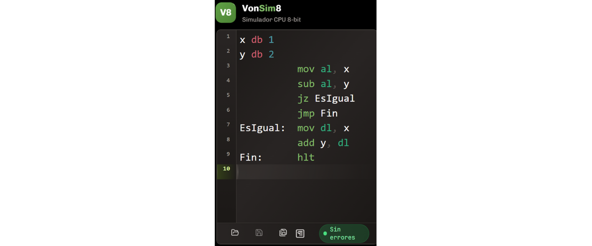
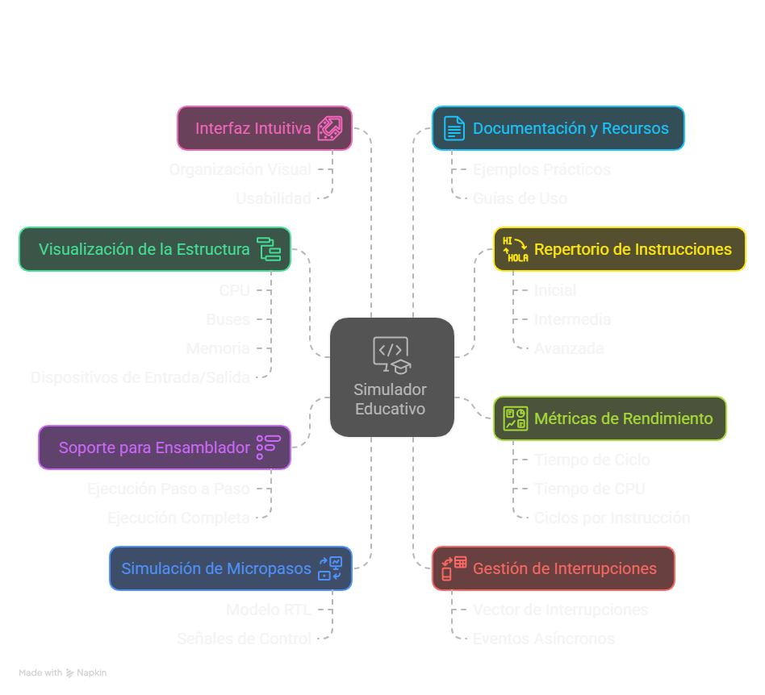

# Diseño y Construcción del Simulador {#desarrollo}
En este capítulo se describe el diseño y desarrollo de una herramienta de simulación específica para la arquitectura x86, orientada a facilitar la enseñanza de los principios de arquitectura de computadoras. Se detalla la justificación del diseño, los pasos seguidos para su construcción y los métodos utilizados para validar su funcionalidad.

En el capítulo anterior se analizaron y evaluaron las herramientas de simulación existentes para la arquitectura x86. Esta revisión exhaustiva permitió identificar las limitaciones de las soluciones actuales y fundamentar la necesidad de desarrollar una herramienta específica (véase el capítulo \@ref(comparativa)).

A partir de esta necesidad, se establecieron un conjunto de requisitos funcionales y pedagógicos que guiaron de manera integral el diseño, la implementación y la validación del simulador. Estos requisitos no solo responden a las limitaciones observadas en herramientas existentes, sino que se alinean con los objetivos educativos previamente definidos.

## Requisitos de la herramienta y su fundamentación
Esta sección expone los requisitos que orientaron el diseño del simulador, clasificados en dos dimensiones complementarias: pedagógica y funcional. La primera se vincula con los objetivos formativos definidos en el capítulo introductorio (\@ref(intro)), mientras que la segunda refiere a las características técnicas necesarias para garantizar su implementación eficaz. Su definición se apoyó en principios pedagógicos y técnicos, y se complementó con una validación empírica basada en entrevistas semiestructuradas a docentes expertos. Este proceso permitió identificar necesidades concretas del aula, así como carencias en las herramientas existentes (ver Anexo A \@ref(anexoA)). La aplicación de una metodología cualitativa, centrada en entrevistas semiestructuradas a docentes expertos, permitió identificar necesidades auténticas del aula y carencias específicas en las herramientas existentes. Estos hallazgos aportaron una base empírica rigurosa para la formulación técnica y pedagógica de los requisitos que guían el diseño del simulador [@huberman2019qualitative].

1. **Visualización de la estructura general de la computadora:**
Incluir una representación gráfica de la arquitectura básica de la computadora —compuesta por CPU, buses, memoria y dispositivos de entrada/salida— durante la ejecución de los programas. La visualización debe destacar los componentes activos en cada etapa del ciclo de ejecución, facilitando una comprensión sistémica e integrada del funcionamiento de la computadora. El uso de representaciones gráficas como recurso didáctico está respaldado por estudios que demuestran su efectividad para facilitar la comprensión de conceptos abstractos en disciplinas técnicas [@sorva2013visualizations]. La Figura \@ref(fig:diagramasimulador) presenta un diagrama estructural que representa los principales módulos del simulador y sus interacciones. Este recurso visual permite integrar, de forma esquemática, los componentes funcionales implementados y su correspondencia con los objetivos pedagógicos definidos.

```{r diagramasimulador, echo=FALSE, fig.cap="Estructura del simulador y componentes funcionales", fig.align = 'center', out.width = "90%"}
knitr::include_graphics("images/estructurasimulador.png")
```

2. **Soporte para la generación y ejecución de programas en ensamblador:**
Incorporar la posibilidad de ejecutar programas escritos en lenguaje ensamblador tanto de forma paso a paso como en ejecución continua. Esta funcionalidad posibilita el análisis detallado de cada instrucción, fortaleciendo competencias en trazado y depuración de código ensamblador, fundamentales para comprender la relación entre software y hardware.
La inclusión de un editor de ensamblador con resaltado de sintaxis y autocompletado mejora la experiencia del usuario, facilitando la escritura y comprensión del código. Esta funcionalidad se basa en principios de diseño de interfaces que promueven la usabilidad y la accesibilidad [@w3c_accessibility_2021]. El editor debe permitir al usuario escribir, editar y guardar programas en ensamblador, así como ejecutar estos programas dentro del simulador. La incorporación de entornos de desarrollo integrados (IDEs) en contextos educativos ha demostrado ser eficaz para la enseñanza de lenguajes de programación, según diversos estudios [@mccracken2001does].

```{r editor, echo=FALSE, fig.cap="Editor ensamblador", fig.align = 'center', out.width = "90%"}

```

3. **Repertorio reducido de instrucciones con activación progresiva:**
Se selecciona un subconjunto esencial del conjunto de instrucciones x86, el cual se habilita en etapas secuenciales del proceso de enseñanza, en correspondencia con el avance de los contenidos curriculares. Esta decisión se fundamenta en principios de la psicología cognitiva que sugieren que la introducción escalonada de contenidos técnicos mejora la retención y reduce la sobrecarga cognitiva [@nationalacademies2018how]. Esta estrategia también se encuentra respaldada por autores como Hasan [@hasan_survey_2012], Null y Lobur [@null_essentials_2023], y Stallings [@stallings_computer_2021], quienes proponen abordajes similares en la enseñanza de arquitecturas complejas.

```{r activacionprogresiva, echo=FALSE, message=FALSE, warning=FALSE}
library(knitr)
library(kableExtra)

# Crear los datos de la tabla de activación progresiva
activacionprogresiva <- data.frame(
  Fase = c("Inicial", "Intermedia", "Avanzada"),
  `Instrucciones activadas` = c(
    "MOV, ADD, SUB, HLT",
    "CMP, JMP, JZ, JC",
    "CALL, RET, IN, OUT, INT, IRET"
  ),
  `Objetivo didáctico` = c(
    "Comprensión del ciclo de instrucción básico",
    "Introducción a control de flujo",
    "Manejo de periféricos e interrupciones"
  )
)

tabla_activacion <- kable(activacionprogresiva,
               format = ifelse(knitr::is_latex_output(), "latex", "html"),
               caption = "Activación progresiva del repertorio de instrucciones",
               col.names = c("Fase", "Instrucciones activadas", "Objetivo didáctico"),
               booktabs = TRUE,
               escape = FALSE,
               align = c("c", "c", "c"))

if (knitr::is_latex_output()) {
  tabla_activacion %>%
    kable_styling(
      latex_options = c("scale_down", "hold_position"),
      font_size = 10
    ) %>%
    column_spec(1, width = "3cm", bold = TRUE, border_right = TRUE) %>%
    column_spec(2:3, width = "6cm") %>%
    row_spec(0, bold = TRUE, align = "c", background = "#D3D3D3") %>%
    row_spec(seq_len(nrow(activacionprogresiva)),
             extra_latex_after = "\\addlinespace[10pt]")
} else {
  tabla_activacion %>%
    kable_styling(
      bootstrap_options = c("striped", "hover", "condensed", "responsive"),
      full_width = FALSE,
      position = "center"
    ) %>%
    column_spec(1, width = "12em", bold = TRUE, border_right = TRUE) %>%
    column_spec(2:3, width = "28em") %>%
    row_spec(0, bold = TRUE, color = "white", background = "#0073C2")
}
```

Una vez establecido el repertorio esencial, se plantea avanzar hacia una comprensión más profunda del ciclo de instrucción mediante su representación en el nivel microarquitectónico. Esta representación incluirá la visualización dinámica de registros activos y señales de control, en correspondencia directa con la ejecución de cada instrucción. Este enfoque promueve el desarrollo progresivo de competencias, al mitigar la sobrecarga cognitiva que implicaría abordar de forma prematura el repertorio completo de instrucciones. La activación progresiva del repertorio se fundamenta en teorías de aprendizaje que sugieren que la exposición gradual a nuevos conceptos mejora la comprensión y retención [@sweller2010cognitive]. Además, esta estrategia se alinea con las recomendaciones de autores como Null y Lobur [@null_essentials_2023], quienes destacan la importancia de introducir los conceptos de forma escalonada para facilitar el aprendizaje efectivo.

4. **Simulación visual e interactiva de micropasos de instrucciones:**
Se implementa una visualización interactiva del flujo de datos basada en el modelo de Nivel de Transferencia entre Registros (Register Transfer Level, RTL). Este enfoque permite representar con precisión el desplazamiento de datos entre registros, buses y unidades funcionales del procesador, así como las señales de control involucradas en cada fase del ciclo de instrucción [@ASMVisualizer2025; @harris2015digital]. Stallings [@stallings_computer_2021] propone utilizar el modelo RTL para representar el ciclo de instrucción, desde la captura (fetch) hasta la ejecución (execute), facilitando la visualización del recorrido de datos y de las señales de control en cada etapa del proceso. 
  
Como complemento a la descripción anterior, la Figura \@ref(fig:cicloinstruccion) ilustra un ciclo de instrucción típico utilizando la operación MOV AL, BL como ejemplo. Esta representación facilita la identificación de las etapas *fetch*, *decode* y *execute*, así como los registros que participan activamente en cada fase.

```{r cicloinstruccion, echo=FALSE, fig.cap="Ciclo de instrucción: captación y ejecución", fig.align = 'center', out.width = "85%"}
knitr::include_graphics(path = "images/cicloinstruccion.png")
```
    
5. **Gestión básica de interrupciones y periféricos:**
Incluir un vector de interrupciones predefinido que simule eventos externos, como la entrada de datos mediante teclado o la salida de información a través de un monitor. Estas interacciones permiten emular situaciones reales de asincronía, esenciales para la comprensión de mecanismos como la interrupción del flujo de ejecución. Esta funcionalidad tiene un alto valor pedagógico, ya que permite al estudiante explorar de forma interactiva conceptos fundamentales como la asincronía, el manejo de eventos y la interrupción del flujo secuencial de ejecución, los cuales son característicos del diseño de arquitecturas modernas y fundamentales para comprender el funcionamiento de sistemas reales. Su inclusión se alinea con las recomendaciones de autores como Null y Lobur [@null_essentials_2023], quienes destacan el valor de abordar estos conceptos en etapas tempranas de la formación. Además, se incorpora un módulo genérico de entrada/salida programada (Programmed Input/Output, PIO), que actúa como interfaz entre la CPU y los dispositivos periféricos. Este módulo permite simular operaciones mediante instrucciones como IN y OUT, facilitando la interacción del estudiante con dispositivos representados gráficamente, como interruptores y teclas. De esta forma, se promueve una comprensión más tangible de los mecanismos subyacentes al intercambio de información entre el procesador y los dispositivos externos.

```{r perifericos, echo=FALSE, fig.cap="Módulo genérico de entrada/salida programada", fig.align = 'center', out.width = "85%"}
knitr::include_graphics(path = "images/perifericos.png")
```

6. **Métricas de rendimiento:**
Incluir indicadores clave como tiempo de ciclo, tiempo de CPU y ciclos por instrucción (CPI), generados automáticamente a partir de la ejecución de los programas. stos indicadores permiten al estudiante analizar cuantitativamente la eficiencia de la ejecución de un programa, facilitando comparaciones entre diferentes implementaciones. Su inclusión apunta a fortalecer la comprensión de aspectos clave del rendimiento del procesador, promoviendo una formación integral que contemple tanto aspectos funcionales como métricos del comportamiento del sistema [@hennessy2017computer].

```{r metricas, echo=FALSE, fig.cap="Métricas de rendimiento", fig.align = 'center', out.width = "85%"}
knitr::include_graphics(path = "images/metricas.png")
```

7. **Interfaz intuitiva y experiencia de usuario:**
Diseñar una interfaz gráfica de usuario (GUI) intuitiva, accesible y coherente con principios de usabilidad. La organización visual debe facilitar la navegación, la comprensión del flujo de datos y la ejecución de tareas pedagógicas sin distracciones. Se recomienda el uso de colores, etiquetas y animaciones para reforzar el aprendizaje visual, especialmente para representar cambios de estado del sistema y flujos de control [@w3c_accessibility_2021].

8. **Documentación y recursos de apoyo:**
Proporcionar documentación clara y accesible que explique el funcionamiento del simulador, sus componentes y las instrucciones disponibles. Esta documentación debe incluir ejemplos prácticos, guías de uso y recursos adicionales para facilitar la comprensión y el aprendizaje autónomo. La inclusión de tutoriales interactivos y ejemplos prácticos es fundamental para guiar al estudiante en el uso efectivo del simulador, promoviendo un aprendizaje activo y reflexivo [@bonwell1991active].

```{r documentacion, echo=FALSE, fig.cap="Documentación on line", fig.align = 'center', out.width = "90%"}
knitr::include_graphics("images/documentacion.png")
```

Estos requisitos funcionales y pedagógicos se fundamentan en principios de diseño instruccional y psicología cognitiva, y fueron validados mediante entrevistas con docentes expertos en la materia. La Tabla  \@ref(tab:tablafuncionales) resume los principales requisitos funcionales del simulador, junto con los componentes específicos que los implementan.

```{r tablafuncionales, echo=FALSE, message=FALSE, warning=FALSE}
library(knitr)
library(kableExtra)

# Crear los datos de la tabla de requisitos funcionales
tablafuncionales <- data.frame(
  `Requisito funcional` = c(
    "Ejecución paso a paso",
    "Simulación de periféricos",
    "Visualización del ciclo de instrucción"
  ),
  `Componente del simulador que lo implementa` = c(
    "Unidad de Control + Visualizador de registros",
    "Módulo de Entrada/Salida + Vector de interrupciones",
    "Representación RTL interactiva"
  )
)

tabla_req <- kable(tablafuncionales,
                   format = ifelse(knitr::is_latex_output(), "latex", "html"),
                   caption = "Requisitos funcionales y componentes del simulador",
                   col.names = c("Requisito funcional", "Componente del simulador que lo implementa"),
                   booktabs = TRUE,
                   escape = FALSE,
                   align = c("c", "c"))

if (knitr::is_latex_output()) {
  tabla_req %>%
    kable_styling(
      latex_options = c("scale_down", "hold_position"),
      font_size = 10
    ) %>%
    column_spec(1, width = "6cm", bold = TRUE, border_right = TRUE) %>%
    column_spec(2, width = "8cm") %>%
    row_spec(0, bold = TRUE, align = "c", background = "#D3D3D3") %>%
    row_spec(seq_len(nrow(tablafuncionales)),
             extra_latex_after = "\\addlinespace[10pt]")
} else {
  tabla_req %>%
    kable_styling(
      bootstrap_options = c("striped", "hover", "condensed", "responsive"),
      full_width = FALSE,
      position = "center"
    ) %>%
    column_spec(1, width = "18em", bold = TRUE, border_right = TRUE) %>%
    column_spec(2, width = "32em") %>%
    row_spec(0, bold = TRUE, color = "white", background = "#0073C2")
}
```

Además de responder a criterios técnicos, estos requisitos fueron definidos en conjunto con docentes especialistas del área, a través de reuniones y talleres de validación donde se analizaron prototipos tempranos y necesidades concretas del aula, garantizando así su relevancia didáctica y su adecuación al contexto educativo de la asignatura Arquitectura de Computadoras.

En conjunto, estos requisitos orientan el diseño del simulador para maximizar su impacto pedagógico y su utilidad como recurso de apoyo a la enseñanza de arquitectura x86. En la siguiente sección se describe cómo fueron implementados funcionalmente estos requisitos, detallando su correspondencia con la estructura modular del simulador.

```{r requisitos, echo=FALSE, fig.cap="Resumen requisitos", fig.align = 'center', out.width = "90%"}

```

```{r requisitosresumen, echo=FALSE, message=FALSE, warning=FALSE}
library(knitr)
library(kableExtra)

# Crear los datos de la tabla de requisitos y fundamento
requisitosresumen <- data.frame(
  Requisito = c(
    "Visualización de estructura",
    "Ejecución de programas en ensamblador",
    "Repertorio progresivo de instrucciones",
    "Simulación visual de micropasos",
    "Gestión de interrupciones"
  ),
  Fundamento = c(
    "Comprensión sistémica del hardware",
    "Desarrollo de competencias en lenguaje ensamblador",
    "Disminución de sobrecarga cognitiva",
    "Comprensión del flujo interno de datos",
    "Simulación de asincronía real"
  )
)

tabla_requisitos <- kable(requisitosresumen,
               format = ifelse(knitr::is_latex_output(), "latex", "html"),
               caption = "Resumen de requisitos funcionales y su fundamentación pedagógica",
               col.names = c("Requisito", "Fundamento pedagógico"),
               booktabs = TRUE,
               escape = FALSE,
               align = c("c", "c"))

if (knitr::is_latex_output()) {
  tabla_requisitos %>%
    kable_styling(
      latex_options = c("scale_down", "hold_position"),
      font_size = 10
    ) %>%
    column_spec(1, width = "5cm", bold = TRUE, border_right = TRUE) %>%
    column_spec(2, width = "8cm") %>%
    row_spec(0, bold = TRUE, align = "c", background = "#D3D3D3") %>%
    row_spec(seq_len(nrow(requisitosresumen)),
             extra_latex_after = "\\addlinespace[10pt]")
} else {
  tabla_requisitos %>%
    kable_styling(
      bootstrap_options = c("striped", "hover", "condensed", "responsive"),
      full_width = FALSE,
      position = "center"
    ) %>%
    column_spec(1, width = "16em", bold = TRUE, border_right = TRUE) %>%
    column_spec(2, width = "32em") %>%
    row_spec(0, bold = TRUE, color = "white", background = "#0073C2")
}
```

### Fundamentación de los requisitos del simulador
A partir de los requisitos funcionales detallados anteriormente, se llevó a cabo un proceso colaborativo de análisis con docentes^[Docentes: Marcelo A. Colombani y Amalia G. Delduca] de la asignatura Arquitectura de Computadoras, quienes aportaron su experiencia docente para identificar los elementos de la arquitectura x86 que resultaban prioritarios para representar, simplificar o adaptar en función de los objetivos pedagógicos del simulador. Este análisis condujo a la elección de una arquitectura simplificada de 8 bits, cuyas características se describen más adelante, justificado por su valor didáctico: una arquitectura de 8 bits permite reducir significativamente la complejidad del modelo, sin comprometer la enseñanza de conceptos fundamentales como el ciclo de instrucción, la manipulación de registros o el manejo de interrupciones, permitiendo representar procesos clave con mayor claridad y menor carga cognitiva. La menor cantidad de líneas de datos, registros y operaciones simplifica la visualización de procesos como la ejecución de instrucciones, el flujo de datos y el manejo de interrupciones, favoreciendo la comprensión por parte del estudiante en etapas iniciales del aprendizaje.

La arquitectura x86 se caracteriza por su elevada complejidad, derivada de su extenso repertorio de instrucciones y sus múltiples características avanzadas. Frente a este panorama, el diseño del simulador adopta un enfoque instruccional basado en tres principios pedagógicos clave:

- **Reducir la carga cognitiva**: la simplificación del repertorio y de los componentes permite a los estudiantes enfocarse en principios fundamentales.
- **Aprendizaje progresivo**: se adopta un enfoque escalonado, empezando con un modelo simplificado y avanzando hacia representaciones más completas de x86.
- **Claridad pedagógica**: las prácticas son manejables en términos de tiempo y esfuerzo, favoreciendo un aprendizaje activo, centrado en la resolución progresiva de problemas y libre de sobrecarga cognitiva excesiva.

### Beneficios de la simplificación
El diseño del simulador contribuye a:

- **Comprensión fundamental**: los estudiantes pueden enfocarse en el ciclo de instrucciones, interacción de componentes y flujo básico de datos.
- **Análisis crítico**: comparar el modelo simplificado con x86 real fomenta un aprendizaje reflexivo y profundo.
- **Experimentación práctica**: proporciona un entorno accesible para explorar conceptos y corregir errores.

Diversos autores como Patterson & Hennessy [@hennessy2017computer], Tanenbaum [@tanenbaum_structured_2016] y Null [@null_essentials_2023]  coinciden en que el uso de arquitecturas simplificadas, como las de 8 bits, permite a los estudiantes centrarse en los conceptos fundamentales de la arquitectura de computadores sin verse abrumados por la complejidad técnica de arquitecturas reales. Este enfoque hace posible observar la transferencia de datos entre registros y la activación de señales de control en cada etapa, favoreciendo la comprensión del funcionamiento interno del procesador.
El modelo propuesto adopta una arquitectura simplificada de 8 bits, inspirada en los principios de la arquitectura x86 [@intel_microarchitecture_2021], y diseñada con un repertorio reducido de instrucciones. La elección de una arquitectura de 8 bits obedece a criterios pedagógicos, ya que simplifica el modelo sin sacrificar los principios fundamentales del repertorio x86, facilitando así la comprensión progresiva de sus componentes [@patt2019introduction; @majid1999design; @morlan_sap1_2021 ; @Guald_2015_thesis; @silber_tinycpu].

```{r requisitosdidacticos, echo=FALSE, message=FALSE, warning=FALSE}
library(knitr)
library(kableExtra)

# Crear los datos de la tabla
tabladidactica <- data.frame(
  `Requisito didáctico` = c(
    "Ejecución paso a paso",
    "Habilitación progresiva del repertorio",
    "Visualización de ciclos de instrucción (RTL)"
  ),
  `Beneficio pedagógico esperado` = c(
    "Favorece la comprensión secuencial de las instrucciones",
    "Reduce la carga cognitiva y promueve aprendizaje incremental",
    "Facilita el aprendizaje del funcionamiento interno del procesador"
  )
)

tabla <- kable(tabladidactica,
               format = ifelse(knitr::is_latex_output(), "latex", "html"),
               caption = "Requisitos didácticos y beneficios pedagógicos esperados",
               col.names = c("Requisito didáctico", "Beneficio pedagógico esperado"),
               booktabs = TRUE,
               escape = FALSE,
               align = c("c", "c"))

if (knitr::is_latex_output()) {
  tabla %>%
    kable_styling(
      latex_options = c("scale_down", "hold_position"),
      font_size = 10
    ) %>%
    column_spec(1, width = "6cm", bold = TRUE, border_right = TRUE) %>%
    column_spec(2, width = "9cm") %>%
    row_spec(0, bold = TRUE, align = "c", background = "#D3D3D3") %>%
    row_spec(seq_len(nrow(tabladidactica)),
             extra_latex_after = "\\addlinespace[10pt]")
} else {
  tabla %>%
    kable_styling(
      bootstrap_options = c("striped", "hover", "condensed", "responsive"),
      full_width = FALSE,
      position = "center"
    ) %>%
    column_spec(1, width = "18em", bold = TRUE, border_right = TRUE) %>%
    column_spec(2, width = "28em") %>%
    row_spec(0, bold = TRUE, color = "white", background = "#0073C2")
}
```

En síntesis, la definición de estos requisitos busca integrar aspectos funcionales, pedagógicos y técnicos en una herramienta que no solo simule el comportamiento del sistema, sino que facilite activamente los procesos de enseñanza y aprendizaje en arquitectura de computadoras. La articulación entre visualización, ejecución progresiva y análisis de rendimiento proporciona un entorno didáctico rico que responde tanto a las necesidades del aula como a los desafíos de la disciplina.

## Diseño del Simulador
El simulador desarrollado se basa en la arquitectura de Von Neumann, una estructura ampliamente utilizada en los sistemas computacionales modernos debido a su simplicidad conceptual y operativa. Esta arquitectura se caracteriza por emplear una única memoria para almacenar simultáneamente datos e instrucciones. Esta característica facilita la flexibilidad en la ejecución de programas, ya que permite que las instrucciones sean tratadas como datos, facilitando la implementación de técnicas avanzadas como la ejecución dinámica y la optimización del rendimiento.

Para el diseño del simulador desarrollado en este trabajo, se tomó como referencia el simulador VonSim^[VonSim: https://vonsim.github.io/], una herramienta educativa basada en la arquitectura de Von Neumann que permite visualizar y experimentar el ciclo de instrucción de una manera interactiva. Esta herramienta sirvió como base conceptual y funcional debido a su enfoque didáctico y su estructura visual clara, orientada a la enseñanza de principios fundamentales de arquitectura de computadoras [@vonsim].

Considerando los contenidos y objetivos pedagógicos de la asignatura Arquitectura de Computadoras, se desarrolló 
VonSim8^[VonSim8: https://ruiz-jose.github.io/VonSim8/] un simulador concebido en este trabajo como adaptación de VonSim, pero adaptado para operar con registros y memoria de 8 bits, con una interfaz simplificada orientada al aprendizaje progresivo.
VonSim implementa una arquitectura detallada, compuesta por un conjunto amplio de instrucciones, registros y componentes funcionales. Esta complejidad, si bien ofrece una visión integral del funcionamiento interno de una computadora, puede dificultar el aprendizaje inicial al exponer simultáneamente numerosos conceptos avanzados. Por este motivo, se optó por desarrollar una versión simplificada del simulador. La decisión de simplificar la arquitectura responde a la necesidad pedagógica de reducir la carga cognitiva durante las etapas iniciales del aprendizaje, facilitando así una progresiva apropiación de los conceptos fundamentales. A partir de esta base, se introdujeron diversas modificaciones en los componentes, instrucciones y funcionalidades del simulador, priorizando aquellos aspectos conceptuales que se abordan en el programa de la asignatura.

Entre las principales modificaciones realizadas se incluyen: (1) la reducción y simplificación del repertorio de instrucciones; (2) el ajuste en el tamaño de los registros y la memoria para operar con datos de 8 bits; (3) el rediseño de la interfaz gráfica con un enfoque esquemático que representa el flujo de ejecución; y (4) la incorporación de funciones interactivas que permiten visualizar el ciclo de instrucción y comprender el rol específico de cada componente. Las modificaciones implementadas se alinean con los contenidos curriculares de la asignatura y están fundamentadas en los principios del aprendizaje activo [@bonwell1991active].

```{r comparativa-vonsim, echo=FALSE, out.width = "100%", fig.cap="Comparación entre VonSim y VonSim8"}
library(knitr)
library(kableExtra)

comparativa <- data.frame(
  Característica = c("Arquitectura", "Tamaño de registros", "Interfaz gráfica", "Repertorio de instrucciones", "Objetivo didáctico"),
  VonSim = c("Von Neumann", "Variable según versión", "Completa, detallada", "Amplio", "Demostración de conceptos avanzados"),
  VonSim8 = c("Von Neumann", "8 bits", "Simplificada, esquemática", "Reducido y adaptado", "Comprensión progresiva de conceptos básicos")
)

tabla_kable <- kable(comparativa,
               format = ifelse(knitr::is_latex_output(), "latex", "html"),
               caption = "Comparación entre VonSim y VonSim8",
               col.names = c("Característica", "VonSim", "VonSim8"),
               booktabs = TRUE,
               escape = FALSE,
               align = c("c", "c", "c"))

if (knitr::is_latex_output()) {
  tabla_kable %>%
    kable_styling(
      latex_options = c("scale_down", "hold_position"),
      font_size = 10
    ) %>%
    column_spec(1, width = "4cm", bold = TRUE, border_right = TRUE) %>%
    column_spec(2:3, width = "5.5cm") %>%
    row_spec(0, bold = TRUE, align = "c", background = "#D3D3D3") %>%
    row_spec(seq_len(nrow(comparativa)),
             extra_latex_after = "\\addlinespace[10pt]")
} else {
  tabla_kable %>%
    kable_styling(
      bootstrap_options = c("striped", "hover", "condensed", "responsive"),
      full_width = FALSE,
      position = "center"
    ) %>%
    column_spec(1, width = "10em", bold = TRUE, border_right = TRUE) %>%
    column_spec(2:3, width = "32em") %>%
    row_spec(0, bold = TRUE, color = "white", background = "#0073C2")
}
```

El diseño conceptual busca traducir los principios previamente definidos en una arquitectura funcional coherente con los objetivos pedagógicos específicos de la asignatura Arquitectura de Computadoras.

Con los requisitos funcionales y didácticos previamente definidos, se elaboró un diseño conceptual que organiza la estructura interna del simulador en bloques funcionales bien delimitados. Este diseño permite modelar de manera explícita las relaciones entre los distintos componentes, facilitando tanto la implementación como la comprensión de la arquitectura simulada.

La Figura \@ref(fig:esquemavonsim8) presenta una visión esquemática de la arquitectura general del simulador. En ella se distinguen los flujos de datos y de control, representando gráficamente la interacción entre los distintos módulos funcionales durante la ejecución de programas. Dicha representación facilita la comprensión estructural del sistema y su analogía con una arquitectura computacional real, simplificada para fines educativos.

```{r esquemavonsim8, echo=FALSE, fig.cap="Arquitectura general del simulador", fig.align = 'center', out.width = "85%"}
knitr::include_graphics(path = "images/esquemavonsim8.png")
```

La memoria principal se modela como una matriz de 16×16 expresada en hexadecimal, lo que permite almacenar hasta 256 bytes de datos. Esta capacidad es suficiente para la mayoría de los programas de ejemplo utilizados en el curso, y su diseño simplificado facilita la comprensión de los conceptos fundamentales de la memoria en una computadora.

```{r memoria, echo=FALSE, fig.cap="Memoria principal", fig.align = 'center', out.width = "85%"}
knitr::include_graphics(path = "images/memoria.png")
```

El bus de datos, direcciones y control se implementa como un conjunto de líneas que permiten la comunicación entre los distintos componentes del sistema. Este bus es esencial para el intercambio de información entre la CPU, la memoria y los dispositivos de entrada/salida, y su diseño modular permite una fácil expansión en futuras versiones del simulador.

```{r buses, echo=FALSE, fig.cap="Buses", fig.align = 'center', out.width = "85%"}
knitr::include_graphics(path = "images/buses.png")
```

El simulador incluye la representación de un teclado y una pantalla con el objetivo de emular la interacción básica entre el usuario y el sistema. El teclado se modela como un vector de 16 posiciones, cada una capaz de almacenar un carácter ASCII. La pantalla, por su parte, se representa como una matriz de 16×16 que permite visualizar caracteres, facilitando así la comprensión del manejo de entrada y salida de datos en una arquitectura computacional simplificada.

```{r tecladopantalla, echo=FALSE, fig.cap="Teclado y pantalla", fig.align = 'center', out.width = "85%"}
knitr::include_graphics(path = "images/tecladopantalla.png")
```

La elección de estos bloques funcionales responde tanto a la necesidad de modelar componentes esenciales de una computadora real como a criterios pedagógicos de modularidad y claridad conceptual. La Tabla \@ref(tab:bloquesfuncionales) resume los principales bloques que conforman la arquitectura simulada, junto con una breve descripción de su funcionalidad.

```{r bloquesfuncionales, echo=FALSE, message=FALSE, warning=FALSE}
library(knitr)
library(kableExtra)

bloquesfuncionales <- data.frame(
  Bloque = c("Unidad Central de Procesamiento (CPU)",
             "Memoria",
             "Sistema de Entrada/Salida (E/S)",
             "Bus de datos, direcciones y control"),
  Descripción = c("Simulación de registros, Unidad de Control (UC) y Unidad Aritmética y Lógica (ALU).", # nolint
                  "Estructura de memoria y simulación de operaciones de lectura y escritura.", # nolint
                  "Interacción con periféricos y manejo de interrupciones.",
                  "Modelado de la comunicación entre componentes.")
)

# Crear la tabla con formato dinámico
tabla <- kable(bloquesfuncionales,
               format = ifelse(knitr::is_latex_output(), "latex", "html"),
               caption = "Bloques funcionales principales",
               col.names = c("Bloque Funcional", "Descripción"),
               booktabs = TRUE,
               escape = FALSE)

# Convertir a HTML o LaTeX según el formato de salida
if (knitr::is_latex_output()) {
  tabla %>%
    kable_styling(
      latex_options = c("scale_down", "hold_position"),
      font_size = 10
    ) %>%
    column_spec(1, width = "6cm", bold = TRUE, border_right = TRUE) %>%
    column_spec(2, width = "9cm") %>%
    row_spec(0, bold = TRUE, align = "c", background = "#D3D3D3") %>%
    row_spec(seq_len(nrow(bloquesfuncionales)),
             extra_latex_after = "\\addlinespace[10pt]")  # Espacio adicional entre filas # nolint: line_length_linter.
} else {
  tabla %>%
    kable_styling(
      bootstrap_options = c("striped", "hover", "condensed"),
      full_width = FALSE,
      position = "center"
    ) %>%
    column_spec(1, width = "25em", bold = TRUE, border_right = TRUE) %>%
    column_spec(2, width = "40em") %>%
    row_spec(0, bold = TRUE, color = "white", background = "#0073C2")
}
```

### Componentes del CPU
En esta sección se detallan los componentes que conforman la Unidad Central de Procesamiento (CPU) del simulador VonSim8, estableciendo su correspondencia con los elementos de una arquitectura real. La descripción de cada componente se organiza en función de su rol funcional y su relevancia didáctica.

El diseño de los registros busca facilitar el aprendizaje de los distintos modos de direccionamiento y el ciclo de instrucción, aspectos centrales en la enseñanza de arquitectura de computadoras. Se describe en la siguiente tabla \@ref(tab:arq):

```{r arq, echo=FALSE, message=FALSE, warning=FALSE}
library(knitr)
library(kableExtra)

# Crear el data frame con los datos del cuadro
arq <- data.frame(
  `Componente` = c("Arquitectura",
                   "Registros",
                   "",
                   "",
                   "",
                   "Memoria",
                   "Buses",
                   "Instrucciones"),
  `Características` = c("Von Neumann, memoria compartida para datos e instrucciones.", # nolint
                        "4 registros de propósito general (`AL`, `BL`, `CL` y `DL`) de 8 bits cada uno.", # nolint
                        if (knitr::is_latex_output()) {
                          "4 registros de propósito específico:\\begin{itemize} \\item `IP` (Instruction Pointer) \\item `IR` (Instruction Register) \\item `SP` (Stack Pointer) \\item `RS` (registro de estado) \\end{itemize}" # nolint: line_length_linter.
                        } else {
                          "4 registros de propósito específico:<ul><li>`IP` (Instruction Pointer)</li><li>`IR` (Instruction Register)</li><li>`SP` (Stack Pointer)</li><li>`RS` (registro de estado)</li></ul>" # nolint: line_length_linter.
                        },
                        "2 registros de datos  (`MAR`: buffer de direcciones y `MBR`: buffer de datos) para comunicación entre CPU y memoria.", # nolint
                        "2 registros temporales (`ri`: temporal de direcciones y `id`: temporal de datos) que se utilizan para conservar valores temporales durante la ejecución de una instrucción.", # nolint
                        "Capacidad de direccionamiento de 256 posiciones, cada una de byte.", # nolint
                        "Bus de datos y direcciones de 8 bits.",
                        "Longitud variable de instrucciones (1, 2 y 3 Bytes). Modos de direccionamiento: registro a registro, directo, indirecto e inmediato."), # nolint: line_length_linter.
  stringsAsFactors = FALSE
)

# Crear la tabla con formato dinámico
tabla <- kable(arq,
               format = ifelse(knitr::is_latex_output(), "latex", "html"),
               caption = "Componentes del CPU VonSim8",
               col.names = c("Componente", "Características"),
               booktabs = TRUE,
               escape = FALSE)

# Mostrar la tabla en formato adecuado según el tipo de salida
if (knitr::is_latex_output()) {
  tabla %>%
    kable_styling(
      latex_options = c("scale_down", "hold_position"),
      font_size = 10
    ) %>%
    column_spec(1, width = "6cm", bold = TRUE, border_right = TRUE) %>%
    column_spec(2, width = "9cm") %>%
    row_spec(0, bold = TRUE, align = "c", background = "#D3D3D3") %>%
    row_spec(seq_len(nrow(arq)),
             extra_latex_after = "\\addlinespace[10pt]")  # Espacio adicional entre filas # nolint: line_length_linter.
} else {
  tabla %>%
    kable_styling(
      bootstrap_options = c("striped", "hover", "condensed"),
      full_width = FALSE,
      position = "center"
    ) %>%
    column_spec(1, width = "25em", bold = TRUE, border_right = TRUE) %>%
    column_spec(2, width = "40em") %>%
    row_spec(0, bold = TRUE, color = "white", background = "#0073C2")
}
```

### Repertorio de instruciones
El repertorio se diseñó como una simplificación de la arquitectura x86, orientada a mejorar la enseñanza y el aprendizaje. En una primera etapa, se introducen únicamente las instrucciones esenciales para abordar los contenidos iniciales de la asignatura:

```{r setreducido, echo=FALSE, message=FALSE, warning=FALSE}
library(knitr)

# Crear los datos
setreducido <- data.frame(
  Instrucciones = c(
    "Transferencia de datos",
    "Pocesamiento de datos",
    "",
    "",
    "Control de flujo",
    "",
    "",
    ""
  ),
  `Nemónico` = c(
    "MOV ",
    "ADD",
    "SUB",
    "CMP",
    "JMP",
    "JZ ",
    "JC ",
    "HLT"
  ),
  Acción = c(
   "Copiar",
  "Sumar",
  "Restar",
  "Comparar",
  "Salto incondicional ",
  "Salto condicional si Z=1",
  "Salto condicional si C=1",
  "Detiene CPU"
  )
)

# Crear la tabla con formato dinámico
tabla <- kable(setreducido,
               format = ifelse(knitr::is_latex_output(), "latex", "html"),
               caption = "Tabla de instrucciones de VonSim8",
               col.names = c("Instrucciones", "nemónico", "Acción"), # nolint: line_length_linter.
               booktabs = TRUE,
               escape = FALSE)


# Mostrar la tabla en formato adecuado según el tipo de salida
if (knitr::is_latex_output()) {
  tabla %>%
    kable_styling(
      latex_options = c("scale_down", "hold_position"),
      font_size = 10
    ) %>%
    column_spec(1, width = "6cm", bold = TRUE, border_right = TRUE) %>% # nolint: line_length_linter.
    column_spec(2, width = "4cm") %>%
    column_spec(3, width = "6cm") %>%
    row_spec(0, bold = TRUE, align = "c", background = "#D3D3D3") %>%
    row_spec(seq_len(nrow(setreducido)), extra_latex_after = "\\addlinespace[8pt]") # Espacio adicional entre filas # nolint: line_length_linter.
} else {
  tabla %>%
    kable_styling(
      bootstrap_options = c("striped", "hover", "condensed"),
      full_width = FALSE,
      position = "center"
    ) %>%
    column_spec(1, width = "25em", bold = TRUE) %>% # nolint: line_length_linter.
    column_spec(2, width = "15em") %>%
    column_spec(3, width = "25em") %>%
    row_spec(0, bold = TRUE, color = "white", background = "#0073C2") %>%
    footnote(
      general = "Las instrucciones de transferencia y de procesamiento de datos tienen los tres tipos de combinaciones en los operandos.", # nolint: line_length_linter.
      general_title = "Nota: ",
      threeparttable = TRUE
    )
}
```

### Formato de instrucciones
El formato de las instrucciones se basa en la codificación binaria, donde cada instrucción se representa mediante un código de operación (opcode) seguido de los operandos. La tabla \@ref(tab:codtraducido) muestra el formato de las instrucciones y su codificación binaria.

```{r codtraducido, echo=FALSE, message=FALSE, warning=FALSE}
library(knitr)
library(kableExtra)
library(magrittr)

# Crear un dataframe con los datos
codtraducido <- data.frame(
  Tipo = c("", "Transferencia y procesamiento", "", "Control"),
  Operación = c("A: entre registros", "B: Cargar a registro", "C: Almacenar en memoria", "D: control de flujo"), # nolint: line_length_linter.
  Codificación = c("____XXYY", "____XX00 MMMMMMMM", "____00YY MMMMMMMM", "____ffff MMMMMMMM"), # nolint: line_length_linter.
  Parámetros = c(
    "XX = Registro destino\nYY = Registro fuente",
    "XX = Registro destino\nM = Dirección de memoria",
    "YY = Registro fuente\nM = Dirección de memoria",
    "ffff = funcionalidad\nM = Dirección de memoria"
  ),
  stringsAsFactors = FALSE
)

# Mostrar la tabla en formato adecuado según el tipo de salida
if (knitr::is_latex_output()) {
  kable(codtraducido, format = "latex", booktabs = TRUE, align = "l", col.names = c("Tipo", "Operación", "Codificación", "Parámetros"), # nolint: line_length_linter.
        caption = "Tabla de codificación de instrucciones") %>%
    kable_styling(latex_options = c("hold_position", "scale_down")) %>%
    column_spec(1, width = "3cm") %>%
    column_spec(2, width = "5cm") %>%
    column_spec(3, width = "5cm") %>%
    column_spec(4, width = "6cm") %>%
    row_spec(3, extra_latex_after = "\\midrule")
} else {
  kable(codtraducido, format = "html", table.attr = "class='table table-striped'", align = "l", col.names = c("Tipo", "Operación", "Codificación", "Parámetros"), # nolint: line_length_linter.
        caption = "Tabla de codificación de instrucciones") %>%
    kable_styling(full_width = FALSE, position = "center") %>%
    column_spec(1, width = "20em") %>%
    column_spec(2, width = "25em") %>%
    column_spec(3, width = "25em", extra_css = "font-size: 6pt;") %>%
    column_spec(4, width = "30em")
}
```

Considerando:

  - `____`: Código de operación de la instrucción, número de 4 bits.

    - `XX` o `YY`: Índices de registros, número entre `0` y `3`, cada índice es de 2 bits.
    
```{r tabla_registros, echo=FALSE, message=FALSE, warning=FALSE}
library(knitr)

# Crear un dataframe con los datos
tabla_registros <- data.frame(
  Registro = c("AL", "BL", "CL", "DL"),
  Binario = c("00", "01", "10", "11"),
  Decimal = c(0, 1, 2, 3)
)

# Imprimir la tabla en formato markdown
kable(tabla_registros, format = "markdown", col.names = c("Registros (R)", "Binario", "Decimal")) # nolint: line_length_linter.
```

    - `00`: Indica que el operando es un registro de propósito general.

  - `M`: Dirección de memoria, número de 8 bits.

  - `ffff`: representan el comportamiento de la instrucción, número de 4 bits.

### Modos de direccionamiento
Los modos de direccionamiento definidos en esta etapa son:

- Registro a registro (`Rx`,`Ry`): operandos son registros del procesador.
- Directo (`[M]`): operando es el contenido de una dirección de memoria.

En esta primera etapa se implementan las siguientes instrucciones con estos modos de direccionamiento y formato de instrucciones:

```{r tablainst, echo=FALSE, message=FALSE, warning=FALSE}
library(knitr)

# Crear un dataframe con los datos
tablainst <- data.frame(
  `#` = c(0, 1, 2, 3, 4, 5, 6, 7, 8, 9, "A", "B", "C", "C", "C"),
  Instrucción = c("MOV Rx, Ry", "MOV Rx, [M]", "MOV [M], Ry", "ADD Rx, Ry", "ADD Rx, [M]", "ADD [M], Ry", "SUB Rx, Ry", "SUB Rx, [M]", "SUB [M], Ry", "CMP Rx, Ry", "CMP Rx, [M]", "CMP [M], Ry", "JMP M", "JC M", "JZ M"), # nolint
  Acción = c(
    "Rx ← Ry",
    "Rx ← Mem[Dirección]",
    "Mem[Dirección] ← Rx",
    "Rx ← Rx + Ry",
    "Rx ← Rx + Mem[Dirección]",
    "Mem[Dirección] ← Mem[Dirección] + Ry",
    "Rx ← Rx - Ry",
    "Rx ← Rx - Mem[Dirección]",
    "Mem[Dirección] ← Mem[Dirección] - Ry",
    "Modifica flags de Rx - Ry",
    "Modifica flags de Rx - Mem[Dirección]",
    "Modifica flags de Mem[Dirección] - Ry",
    "IP ← Dirección",
    "Si flag C=1 entonces IP ← Dirección",
    "Si flag Z=1 entonces IP ← Dirección"
  ),
  Codificación = c(
    "0000 XXYY",
    "0001 00YY MMMMMMMM",
    "0010 XX00 MMMMMMMM",
    "0011 XXYY",
    "0100 00YY MMMMMMMM",
    "0101 XX00 MMMMMMMM",
    "0110 XXYY",
    "0111 00YY MMMMMMMM",
    "1000 XX00 MMMMMMMM",
    "1001 XXYY",
    "1010 00YY MMMMMMMM",
    "1011 XX00 MMMMMMMM",
    "1100 0000 MMMMMMMM",
    "1100 0001 MMMMMMMM",
    "1100 0011 MMMMMMMM"
  )
)

# Imprimir la tabla en formato adecuado según el tipo de salida
if (knitr::is_latex_output()) {
  kable(tablainst, format = "latex", booktabs = TRUE, col.names = c("#", "Instrucción", "Acción", "Codificación"), caption = "Tabla de Instrucciones y Codificación") %>% # nolint: line_length_linter.
    kable_styling(latex_options = c("hold_position", "scale_down")) %>%
    column_spec(1, width = "1cm") %>%
    column_spec(2, width = "3cm") %>%
    column_spec(3, width = "5cm") %>%
    column_spec(4, width = "5cm")
} else {
  kable(tablainst, format = "markdown", col.names = c("#", "Instrucción", "Acción", "Codificación")) # nolint: line_length_linter.
}
```

## Ciclo de la instrucción: Etapas de captación y ejecución
En este apartado se detalla el proceso llevado a cabo por la Unidad de Control (UC) para ejecutar cada instrucción, destacando los aspectos clave:

- Secuencia de pasos.
- Registros involucrados en cada etapa del proceso.
- Uso de los buses de datos, direcciones y control.
- Señales de control generadas.

El **ciclo de la instrucción** se define como la secuencia de microoperaciones necesarias para ejecutar una instrucción en el sistema. Estas microoperaciones se expresan mediante un lenguaje de transferencia entre registros, representado de la forma:

`destino` $\leftarrow$ `origen` 


La Figura \@ref(fig:flujoCicloInstruccion) ilustra el flujo básico del ciclo de instrucción implementado en el simulador, permitiendo visualizar los pasos secuenciales de búsqueda, decodificación y ejecución.

```{r flujoCicloInstruccion, echo=FALSE, fig.cap="Flujo del ciclo de instrucción en VonSim8", fig.align = 'center', out.width = "85%"}
knitr::include_graphics(path = "images/cicloinstruccion2.png")
```


### Etapa de Captación: 
En esta etapa, común a todas las instrucciones, consiste en la lectura de la instrucción desde la memoria.

  1. **`MAR` $\leftarrow$ `IP`**:
  el contenido del registro puntero de instrucciones `IP` se transfiere al registro de direcciones de memoria `MAR`. La UC genera la señal necesaria para seleccionar el valor del `IP` y copiarlo en el `MAR`.
  2. **`MDR` $\leftarrow$ `read(Memoria[MAR])` ; `IP` $\leftarrow$ `IP` + 1**:
  la UC activa la señal de lectura (read) hacia la memoria, utilizando el valor del `MAR` como dirección. El dato leído se transfiere al registro de datos de memoria `MBR` a través del bus de datos. Simultáneamente, el `IP` se incrementa en 1 para apuntar al siguiente byte.
  3. **`IR` $\leftarrow$ `MBR`**:
  el contenido del `MBR` se transfiere al registro de instrucciones `IR`, completando la etapa de captación. 

### Etapa de Ejecución:
En esta etapa, las operaciones específicas dependen del tipo de instrucción. A continuación, se describen algunos casos representativos:

* MOV `Rx`, `Ry` (Copia entre registros)
  1. **`Rx` $\leftarrow$ `Ry`**:
  el contenido del registro `Ry` se copia en el registro `Rx`.

* MOV `Rx`, `[Dirección]` (Carga a registro)
  1. **`MAR` $\leftarrow$ `IP`**:
  el valor del `IP` se transfiere a `MAR`.
  2. **`MBR` $\leftarrow$ `read(Memoria[MAR])`; `IP` $\leftarrow$ `IP` + 1**:
  se lee (read) de memoria el contenido de la dirección indicada por `MAR` y se almacena en `MBR`.Simultáneamente, el `IP` se incrementa.
  3. **`MAR` $\leftarrow$ `MBR`**:
  el contenido de `MBR` se transfiere a `MAR`.
  4. **`MBR` $\leftarrow$ `read(Memoria[MAR])`**:
  se lee de memoria el contenido de la dirección indicada por `MAR` y se almacena en `MBR`.
  5. **`Rx`  $\leftarrow$ `MBR`**:
  el contenido del `MBR` se copia al registro `Rx`.

* MOV `[Dirección]`, `Ry` (Almacenar en memoria)     
  1. 2. 3. igual que MOV `Rx`, `[Dirección]`.
  4. **`MBR` $\leftarrow$ `Ry`**:
  el contenido de `Ry` se transfiere a `MBR`.
  5. **`write(Memoria[MAR])` $\leftarrow$ `MBR`**:
  el contenido de `MBR` se escribe (write) en memoria en la dirección apuntada por el `MAR`.

* ADD  `Rx`, `[Dirección]` (Sumar a registro)
  1. 2. 3. 4. igual que MOV `Rx`, `[Dirección]`.
  5. **`Rx`  $\leftarrow$ `Rx` + `MBR`**:
  la Unidad Aritmético-Lógica (ALU) realiza la suma entre `Rx` y `MBR`, almacenando el resultado en `Rx`. El Registro de Estado `RS` se actualiza con los indicadores correspondientes.

* SUB `[Dirección]`, `Ry` (Restar a memoria)
  1. 2. 3. 4. igual que MOV `Rx`, `[Dirección]`.
  5. **`MBR` $\leftarrow$ `Ry` - `MBR`**: 
  la ALU resta el contenido de `MBR` al de `Ry`, almacenando el resultado en `MBR`. El `RS` se actualiza.
  6. **`write(Memoria[MAR])` $\leftarrow$ `MBR`**:
  el contenido de `MBR` se escribe en memoria en la dirección apuntada por el `MAR`.

* CMP `Rx`,  `[Dirección]` (Comparar a registro)
  1. 2. 3. 4. igual que MOV `Rx`, `[Dirección]`.
  5. **`Rx` - `MBR`**: 
  la ALU realiza la resta entre el contenido de `Rx` y `MBR`. Aunque el resultado no se almacena, el `RS` se actualiza con los indicadores de comparación.

* JMP  `Dirección` (Salto incondicional)
  1. 2. igual que MOV `Rx`, `[Dirección]`.
  3. **`IP` $\leftarrow$ `MBR`**:
  El contenido del `MBR` se transfiere al registro `IP`, estableciendo la nueva dirección de ejecución.

* JC  `Dirección` (Salto condicional si C=1)
  1. 2. Igual que MOV `Rx`, `[Dirección]`.
  3. `Si C` == 1: **`IP` $\leftarrow$ `MBR`**:
  si la bandera de acarreo (`C`) está activa, el contenido del `MBR` se transfiere al registro `IP`.

* JZ  `Dirección` (Salto condicional si Z=1)
  1. 2. igual que MOV `Rx`, `[Dirección]`.
  3. `Si Z` == 1: **`IP` $\leftarrow$ `MBR`**:
  si la bandera de cero (`Z`) está activa, el contenido del `MBR` se transfiere al registro `IP`.

## Diseño Ampliado del Simulador VonSim8
En esta sección se presentan las modificaciones y ampliaciones realizadas al diseño del simulador VonSim8, con el objetivo de enriquecer la experiencia de aprendizaje y adaptarlo a los contenidos avanzados de la asignatura Arquitectura de Computadoras.

### Nuevos requisitos funcionales
Se incorporan nuevos requisitos funcionales para ampliar las capacidades del simulador, permitiendo una mayor flexibilidad y profundidad en el aprendizaje:
- **Modos de direccionamiento adicionales**: Se añaden nuevos modos de direccionamiento para enriquecer la variedad de operaciones que se pueden realizar.
- **Formato ampliado de instrucciones**: Se implementa un formato de instrucciones más flexible, permitiendo codificar instrucciones con 1, 2 o 3 bytes según el modo de direccionamiento utilizado.
- **Instrucciones adicionales**: Se introducen nuevas instrucciones que amplían el repertorio del simulador, permitiendo a los estudiantes explorar conceptos más avanzados de arquitectura de computadoras.


### Modos de direccionamiento adicionales
Se incoporan los siguientes modos de direccionamiento:

- Indirecto por registro (`[BL]`): la dirección del operando se encuentra en el registro `BL` del procesador.
- Inmediato (`d`): operando es un valor contenido en la instrucción. 

### Formato ampliado de instrucciones
Las instrucciones ahora se codifican con 1, 2 o 3 bytes dependiendo del modo:

Las instrucciones de cargar a registro (B):

```{r dirampliado, echo=FALSE, message=FALSE, warning=FALSE}
library(knitr)
library(kableExtra)

# Definir los datos de la tabla
dirampliado <- data.frame(
  `Función` = c("00", "01", "10", "11"),
  `Byte` = c("2", "1", "2", "2"),
  `Interpretación` = c(
    "Directo `M` = Dirección de memoria",
    "Indirecto utiliza como operando implícito el registro `BL` y no requiere operando `M`", # nolint: line_length_linter.
    "Inmediato `d` = Dato inmediato",
    "Indirecto la dirección se calcula operando implícito `BL` + Dato inmediato"
  )
)

kable(dirampliado, format = "markdown", col.names = c("Función", "Byte", "Interpretación")) # nolint: line_length_linter.
```


Las instrucciones de almacenar en memoria (C):

```{r dirampliado2, echo=FALSE, message=FALSE, warning=FALSE}
library(knitr)
library(kableExtra)

# Definir los datos de la tabla
dirampliado2 <- data.frame(
  `Función` = c("00YY", "01YY", "01YY", "1100", "1101", "1110"),
  `Byte` = c("2", "1", "2", "3", "2", "3"),
  `Interpretación` = c(
    "directo `D` = Dirección de memoria, `YY` = Registro fuente",
    "indirecto `BL`, `YY` = Registro fuente",
    "Indirecto la dirección se calcula operando implícito `BL` + Dato Inmediato", # nolint: line_length_linter.
    "Inmediato a memoria",
    "Inmediato a memoria mediante indirecto `BL`",
    "Inmediato a memoria mediante indirecto `BL`+ Dato Inmediato"
  )
)

kable(dirampliado2, format = "markdown", col.names = c("Función", "Byte", "Interpretación")) # nolint: line_length_linter.
```

El formato ampliado para las instrucciones incluye los siguientes casos tabla \@ref(tab:formatoampliado):

```{r formatoampliado, echo=FALSE, message=FALSE, warning=FALSE}
library(knitr)
library(kableExtra)

# Crear un dataframe con los datos
formatoampliado <- data.frame(
  Tipo = c("Transferencia y procesamiento", "", "", "", "", "Control"),
  Operación = c("A: entre registros", "B: Cargar a registro", "", "", "C: Almacenar en memoria", "D: control de flujo"), # nolint: line_length_linter.
  Codificación = c("____XXYY", "____XX00 MMMMMMMM", "____XX01", "____XX00 dddddddd", "____00YY MMMMMMMM dddddddd", "____ffff MMMMMMMM"), # nolint: line_length_linter, line_length_linter.
  Parámetros = c(
    "XX = Registro destino, YY = Registro fuente",
    "XX00 = Registro destino y M = Dirección de memoria",
    "XX01 = Registro destino y direccion en registro [BL]",
    "XX10 = Registro destino y d = Dato inmediato",
    "YY = Registro fuente, `M` = Dirección de memoria,  `d` = Dato Inmediato",
    "ffff = funcionalidad, M = Dirección de memoria"
  ),
  stringsAsFactors = FALSE
)

# Mostrar la tabla en formato adecuado según el tipo de salida
if (knitr::is_latex_output()) {
  kable(formatoampliado, format = "latex", booktabs = TRUE, align = "l", col.names = c("Tipo", "Operación", "Codificación", "Parámetros"), # nolint: line_length_linter.
        caption = "Tabla de codificación de instrucciones ampliado") %>%
    kable_styling(latex_options = c("hold_position", "scale_down")) %>%
    column_spec(1, width = "4cm") %>%
    column_spec(2, width = "5cm") %>%
    column_spec(3, width = "5cm") %>%
    column_spec(4, width = "6cm") %>%
    row_spec(4, extra_latex_after = "\\midrule") %>%
    footnote(
      general = "d = dato inmediato, no puede ser destino de la instrucción.", # nolint: line_length_linter.
      general_title = "Nota: ",
      threeparttable = TRUE
    )
} else {
  kable(formatoampliado, format = "html", table.attr = "class='table table-striped'", align = "l", col.names = c("Tipo", "Operación", "Codificación", "Parámetros"), # nolint: line_length_linter.
        caption = "Tabla de codificación de instrucciones ampliado") %>%
    kable_styling(full_width = FALSE, position = "center") %>%
    column_spec(1, width = "20em") %>%
    column_spec(2, width = "25em") %>%
    column_spec(3, width = "25em") %>%
    column_spec(4, width = "30em") %>%
    row_spec(4, extra_css = "border-top: 2px solid #000;") %>%
    footnote(
      general = "d = dato inmediato, no puede ser destino de la instrucción.", # nolint: line_length_linter.
      general_title = "Nota: ",
      threeparttable = TRUE
    )
}
```


```{r formampl2, echo=FALSE, message=FALSE, warning=FALSE}
library(knitr)
library(kableExtra)

# Crear un dataframe con los datos
formampl2 <- data.frame(
  CodOp = c(
    "0",
    "1",
    "1",
    "1",
    "1",
    "2",
    "2",
    "2",
    "2",
    "2",
    "2",
    "3",
    "4",
    "5",
    "6",
    "7",
    "8",
    "9",
    "A",
    "B",
    "C",
    "C",
    "C",
    "C"
  ),
  Instrucción = c(
    "`MOV Rx, Ry`",
    "`MOV Rx, [M]`",
    "`MOV Rx, [BL]`",
    "`MOV Rx, D`",
    "`MOV Rx, [BL + D]`",
    "`MOV [M], Ry`",
    "`MOV [BL], Ry`",
    "`MOV [BL + D], Ry`",
    "`MOV [M], D`",
    "`MOV [BL], D`",
    "`MOV [BL + D], D`",
    "`ADD Rx, Ry`",
    "`ADD Rx, --`",
    "`ADD [M], --`",
    "`SUB Rx, Ry`",
    "`SUB Rx, --`",
    "`SUB [M], --`",
    "`CMP Rx, Ry`",
    "`CMP Rx, --`",
    "`CMP [M], --`",
    "`JMP M`",
    "`JC M`",
    "`JZ M`",
    "`Jxx M`"
  ), # nolint: line_length_linter.
  Acción = c(
    "`Rx` ← `Ry`",
    "`Rx` ← `Mem[Dirección]`",
    "`Rx` ← `Mem[BL]` ",
    "`Rx` ← `Dato`",
    "`Rx` ← `Mem[BL + Dato]` ",
    "`Mem[Dirección]` ← `Rx`",
    "`Mem[BL]` ← `Rx`",
    "`Mem[BL + Dato]` ← `Rx`",
    "`Mem[Dirección]` ← `Dato`",
    "`Mem[BL]` ← `Dato`",
    "`Mem[BL + Dato]` ← `Dato`",
    "`Rx` ← `Rx + Ry`",
    "Carga en registro",
    "Almacenar en memoria",
    "`Rx` ← `Rx - Ry`",
    "Carga en registro",
    "Almacenar en memoria",
    "`Rx - Ry`: bo almacena el resultado en Rx",
    "registro - memoria",
    "memoria - registro",
    "`IP` ← `Dirección`",
    "Si `C` = 1 entonces `IP` ← `Dirección`",
    "Si `Z` = 1 entonces `IP` ← `Dirección`",
    "Se pueden implementar más flags y CALL"
  ), # nolint: line_length_linter, line_length_linter.
  Codificación = c(
    "`0000 XXYY`",
    "`0001 XX00 MMMMMMMM`",
    "`0001 XX01`",
    "`0001 XX10 MMMMMMMM`",
    "`0001 XX11 MMMMMMMM`",
    "`0010 00YY MMMMMMMM`",
    "`0010 01YY`",
    "`0010 10YY MMMMMMMM`",
    "`0010 1100 MMMMMMMM dddddddd`",
    "`0010 1101 MMMMMMMM`",
    "`0010 1110 MMMMMMMM`",
    "`0011 XXYY`",
    "`0100 ---- --------`",
    "`0101 ---- -------- --------`",
    "`0110 XXYY`",
    "`0111 ---- --------`",
    "`1000 ---- -------- --------`",
    "`1001 XXYY`",
    "`1010 ---- --------`",
    "`1011 ---- -------- --------`",
    "`1100 0000 MMMMMMMM`",
    "`1100 0001 MMMMMMMM`",
    "`1100 0011 MMMMMMMM`",
    "`1100 ffff MMMMMMMM`"
  ),
  stringsAsFactors = FALSE
)

# Mostrar la tabla en formato adecuado según el tipo de salida
if (knitr::is_latex_output()) {
  kable(formampl2, format = "latex", booktabs = TRUE, align = "l", col.names = c("CodOp", "Instrucción", "Acción", "Codificación"), # nolint: line_length_linter.
        caption = "Tabla de codificación de instrucciones ampliado") %>%
    kable_styling(latex_options = c("hold_position", "scale_down")) %>%
    column_spec(1, width = "4cm") %>%
    column_spec(2, width = "5cm") %>%
    column_spec(3, width = "5cm") %>%
    column_spec(4, width = "6cm") %>%
    row_spec(24, extra_latex_after = "\\midrule")
} else {
  kable(formampl2, format = "html", table.attr = "class='table table-striped'", align = "l", col.names = c("CodOp", "Instrucción", "Acción", "Codificación"), # nolint: line_length_linter.
        caption = "Tabla de codificación de instrucciones ampliado") %>%
    kable_styling(full_width = FALSE, position = "center") %>%
    column_spec(1, width = "20em") %>%
    column_spec(2, width = "25em") %>%
    column_spec(3, width = "25em") %>%
    column_spec(4, width = "30em") %>%
    row_spec(24, extra_css = "border-top: 2px solid #000;")
}
```

### Ciclo de la instrucción: modos adicionales

* MOV `Rx`, `[BL]` (Carga indirecto) 
  1. **`MAR` $\leftarrow$ `IP`**:
  El valor del `IP` se transfiere a `MAR`.
  2. **`MBR` $\leftarrow$ `read(Memoria[MAR])`; `IP` $\leftarrow$ `IP` + 1**:
  Se lee (read) de memoria el contenido de la dirección indicada por `MAR` y se almacena en `MBR`.Simultáneamente, el `IP` se incrementa.
  3. **`MAR` $\leftarrow$ `BL`**:
  El contenido de `BL` se transfiere a `MAR`.
  4. **`MBR` $\leftarrow$ `read(Memoria[MAR])`**:
  Se lee de memoria el contenido de la dirección indicada por `MAR` y se almacena en `MBR`.
  5. **`Rx`  $\leftarrow$ `MBR`**:
  El contenido del `MBR` se copia al registro `Rx`.

* MOV `Rx`, `Dato` (Carga valor inmediato)
  1. **`MAR` $\leftarrow$ `IP`**:
  El valor del `IP` se transfiere a `MAR`.
  2. **`MBR` $\leftarrow$ `read(Memoria[MAR])`; `IP` $\leftarrow$ `IP` + 1**:
  Se lee (read) de memoria el contenido de la dirección indicada por `MAR` y se almacena en `MBR`.Simultáneamente, el `IP` se incrementa.
  3. **`Rx`  $\leftarrow$ `MBR`**:
  El contenido del `MBR` se copia al registro `Rx`.

## Tercera etapa
En esta etapa se incorporaron las instrucciones de manejo de pila y de interrupciones, ampliando la funcionalidad del simulador para cubrir un conjunto más completo de operaciones propias de la arquitectura x86.
A continuación, se detalla el conjunto completo de instrucciones, incluyendo su clasificación, nemónicos y las acciones que representan.

```{r isacompleta, echo=FALSE, message=FALSE, warning=FALSE}
library(knitr)
library(kableExtra)

isacompleta <- data.frame(
  `Código operación` = c("MOV", "ADD", "JMP", "PUSH, POP, OUT, IN", "INT , IRET", "NOP , HLT"),
  Instrucciones = c("Transferencia de datos", "Aritmética", "Control de flujo", "Pila y E/S", "Interrupciones", "Control"),
  nemónico = c(
    "MOV destino, origen",
    "ADD destino, origen",
    "JMP destino",
    "PUSH, POP, OUT, IN",
    "INT , IRET",
    "NOP , HLT"
  ),
  Acción = c(
    "1- Copiar entre registros 2- Cargar a registro 3- Almacenar en memoria",
    "1- Sumar  2- Restar 3- Comparar",
    "Salto incondicional JMP. Saltos condicionales Jxx. Llamadas a rutinas CALL y retorno RET",
    "Poner en la pila PUSH. Retirar de la pila POP. Enviar un byte al puerto del dispositivo de E/S. Recibir un byte del dispositivo de E/S",
    "Llamar a una rutina de tratamiento de interrupción INT. Retornar de una rutina de tratamiento de interrupción IRET",
    "No opera NOP. Detiene el CPU HLT"
  )
)

tabla_kable <- kable(isacompleta,
               format = ifelse(knitr::is_latex_output(), "latex", "html"),
               caption = "Tabla de Instrucciones y Códigos de Operación de la Arquitectura x86",
               col.names = c("Código operación", "Instrucciones", "Nemónico", "Acción"),
               booktabs = TRUE,
               escape = FALSE,
               align = c("c", "c", "c", "c"))

if (knitr::is_latex_output()) {
  tabla_kable %>%
    kable_styling(
      latex_options = c("scale_down", "hold_position"),
      font_size = 10
    ) %>%
    column_spec(1, width = "4cm", bold = TRUE, border_right = TRUE) %>%
    column_spec(2:4, width = "5.5cm") %>%
    row_spec(0, bold = TRUE, align = "c", background = "#D3D3D3") %>%
    row_spec(seq_len(nrow(isacompleta)),
             extra_latex_after = "\\addlinespace[10pt]")
} else {
  tabla_kable %>%
    kable_styling(
      bootstrap_options = c("striped", "hover", "condensed", "responsive"),
      full_width = FALSE,
      position = "center"
    ) %>%
    column_spec(1, width = "10em", bold = TRUE, border_right = TRUE) %>%
    column_spec(2:4, width = "32em") %>%
    row_spec(0, bold = TRUE, color = "white", background = "#0073C2")
}
```

## Aspectos tecnológicos de implementación
Se utiliza un enfoque modular para la implementación del simulador, facilitando su mantenimiento y ampliación futura. La arquitectura del simulador se basa en una estructura de capas, donde cada capa se encarga de una parte específica del proceso de simulación.

## Simulación visual e interactiva
Esta sección detalla la implementación de las características visuales e interactivas del simulador, diseñadas para facilitar la comprensión del flujo de datos y las microoperaciones dentro de la arquitectura x86.

### Representación gráfica de componentes
- **Diseño de la interfaz visual**: incluye elementos como registros, buses y memoria, presentados de manera clara y organizada.
- **Resaltado dinámico**: los componentes relevantes se destacan visualmente durante la ejecución, proporcionando un seguimiento en tiempo real del flujo de datos.

### Ejecución paso a paso
- **Flujo interactivo**: permite avanzar por cada etapa del ciclo de instrucción, desde la captura hasta la finalización.
- **Opciones de visualización**: se pueden observar los micropasos que conforman cada etapa de la ejecución, fomentando una comprensión detallada del proceso.

## Gestión de interrupciones y periféricos
Se describe la simulación de interrupciones y operaciones de entrada/salida, proporcionando una implementación básica para la interacción con periféricos.

### Manejo del vector de interrupciones
- **Vector predefinido**: se incluye un conjunto de interrupciones estándar.
- **Simulación de interrupciones**: ejemplos como las interacciones con teclado y pantalla están modeladas para su análisis práctico.

### Instrucciones IN y OUT
- **Operaciones de entrada/salida**: se implementan y simulan las instrucciones básicas para la interacción con periféricos.

### Segunda etapa
En esta etapa, se amplían los modos de direccionamiento e instrucciones:

## Integración de métricas de rendimiento
El simulador incorpora métricas clave para analizar el impacto del rendimiento en la arquitectura de computadoras.

### Métricas calculadas
- **Indicadores**: tiempo de ciclo, tiempo de CPU y ciclos por instrucción (CPI).
- **Visualización**: las métricas se presentan en tiempo real durante la simulación, facilitando su análisis.

### Análisis de casos de estudio
- Se incluyen ejemplos que ilustran cómo interpretar las métricas para optimizar el rendimiento.

## Proceso de validación
El proceso de validación garantiza que el simulador cumple con los requisitos pedagógicos y funcionales.

### Validación funcional
- **Pruebas de módulos**: cada componente se verificó de manera individual.
- **Ejecución completa**: programas de prueba comprobaron la correcta implementación de las instrucciones.

### Evaluación pedagógica
- **Retroalimentación**: opiniones de estudiantes y docentes guiaron los ajustes realizados.
- **Objetivos educativos**: el simulador prioriza la claridad conceptual sin sacrificar la precisión técnica.

## Portabilidad y Mantenibilidad
- **Portabilidad**: la herramienta se implementa como una aplicación web, compatible con cualquier navegador moderno.
- **Mantenibilidad**: el código modular y bien documentado facilita futuras actualizaciones y mejoras.
